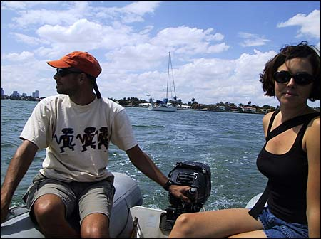
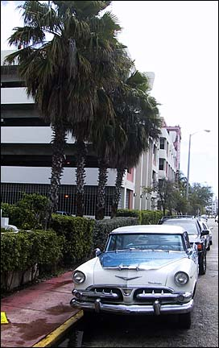
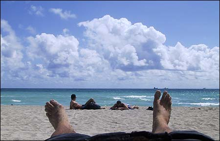
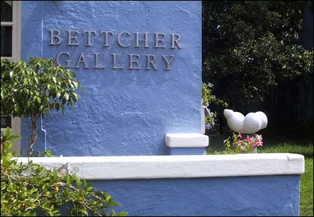
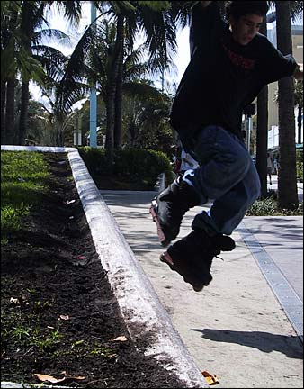
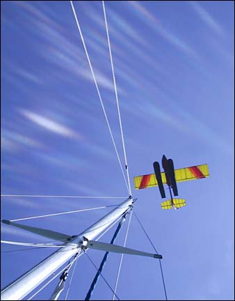
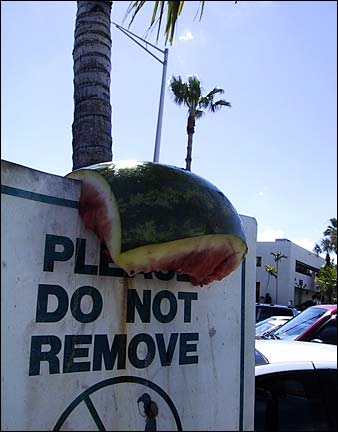
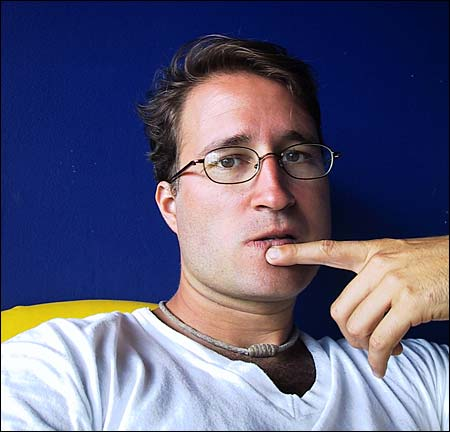

Well, we’ve been anchored here in Miami for about a week now. Not much has happened, really. Just been hanging out, reading books, swimming around the boat, showering on deck, going to movies, eating out, and eating in.

Here’s some random photos from the past few days.

{ .polaroid loading=lazy }

Here’s Nick, Val, and Willow, as we head to shore for one of our daily outings.

{ .polaroid loading=lazy }

I was told there were a lot of classic cars and palm trees in South Beach. These were the only ones I could find.

{ .polaroid loading=lazy }

I walked all the way to the beach just to take a picture of my feet. And it cost me 7 bucks to lie on this cot.

{ .polaroid loading=lazy }

Bettcher Ass.

{ .polaroid loading=lazy }

I spent a half-hour taking pictures of these skater kids and somehow this was the best shot I came away with. Pathetic, huh? Well, I guess it’s not that bad.

{ .polaroid loading=lazy }

Every once in a while we get buzzed by this guy who flies around in this single-seater pontoon plane. I call him the Buzzard.

{ .polaroid loading=lazy }

I walked by this same sign a few days after taking this picture. Sure enough, someone had removed it.

{ .polaroid loading=lazy }

It’s a bit hot here, so I gave myself another haircut, this time on the aft deck, tossing the clippings into the bay. Some guy came over and touched my lip as this picture was being taken.

I been working on a couple new songs here on the boat. Here’s one called Satellite which I just started writing tonight.

<figure>
  <figcaption>Satellite</figcaption>
  <audio controls src="./satellite.mp3" />
</figure>
