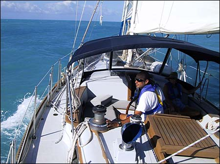
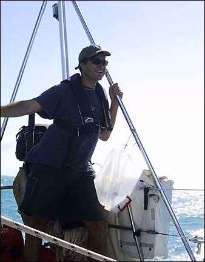
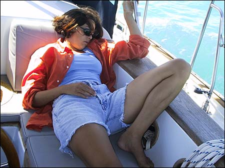

The sail from Marathon to Key West was also great, with steady winds on the beam and 6 knots of average speed. I spent much of the day at the helm, enjoying the feeling of gliding through the water, rolling slightly from side to side. I also I enjoyed the sheer megalomaniacal power of it all. But aren’t we all megalomaniacs at heart?

Here’s pictures of the sail down to Key West.

{ .polaroid loading=lazy }

Nick at the helm and Val riding the stern.

{ .polaroid loading=lazy }

The swell rolled under us at a leisurely pace, lifting us up and setting us down, occasionally splashing us with a bit of spray.

{ .polaroid loading=lazy }

Here’s one of those rare moments where Nick is not watching where he’s going.

{ .polaroid loading=lazy }

Me on the stern, riding the swell.

{ .polaroid loading=lazy }

As the afternoon wore on, we all got a bit tired. Here’s Val passed out in the cockpit.

{ .polaroid loading=lazy }

We reached Key West at around 3:30 in the afternoon and anchored near Fleming Island. Here’s our position. The red line shows our path into the harbor.

{ .polaroid loading=lazy }

Once we tidied up the boat a bit, we had another quick shower on deck and hailed the water taxi to take us ashore for dinner. It’s Spring Break here in Key West, so the mood on shore was festive and light and collegiate. Nick quickly showed he could party with the best of em.

My cousin Chuck (locally known as Chas) lives here so I’m finally getting to hang out with him on his turf. We’ll be here for a few days, enjoying all that Key West has to offer. More later…
