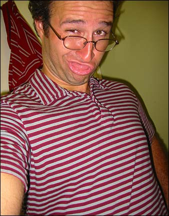
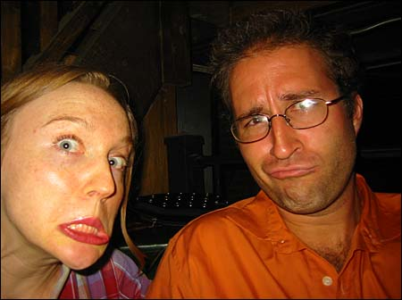
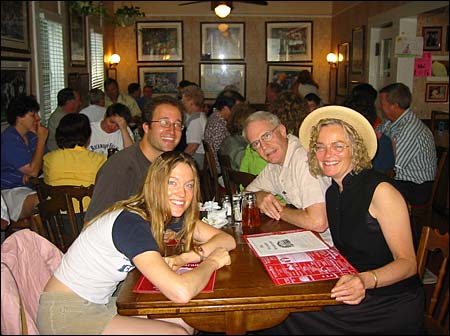
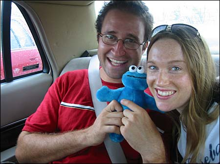

After I got back from New York, I drove to Tuscaloosa to visit my old friend Emily Lundin and her mom Anne. Here’s some pics I took while I was there.

{ .polaroid loading=lazy }

Seems like mostly we went thrift store shopping. Here’s Emily in her new hot pink leather jacket.

{ .polaroid loading=lazy }

Me trying on a striped shirt and a goofy face.

{ .polaroid loading=lazy }

Here’s Anne and her ‘friend’ hmm-hmm John. He just retired after working 30 years at Wisconsin Public Radio. He sure does have a radio voice. He drove all the way down from Wisconsin to see Anne. Isn’t that sweet?

{ .polaroid loading=lazy }

Emily told me to take a picture of her butt in these pants she was trying on. I obliged and then Anne stepped into the frame. Perfect!

{ .polaroid loading=lazy }

Emily trying on a cool but kinda useless raincoat. She decided not to get it.

{ .polaroid loading=lazy }

On Saturday night Emily and I went out on the town to cruise to Tuscaloosa bar scene. Here’s some of the bars we found.

{ .polaroid loading=lazy }

We spent most of our time in one bar, being very elitist and coming up with all kinds of suppositions about the lives of all the normal people around us. It was fun.

{ .polaroid loading=lazy }

Here’s us looking pretty normal…

{ .polaroid loading=lazy }

…and not so normal. I think Emily won this one.

{ .polaroid loading=lazy }

The next morning we went out for a nummy breakfast at the Waysider Inn, a Tuscaloosa tradition.

{ .polaroid loading=lazy }

Then we had to drive Emily to the train station, and it rained on the way. Cookie contemplates the rain.

{ .polaroid loading=lazy }

Here’s Emily and her special brother. And Cookie.

{ .polaroid loading=lazy }

Emily and Cookie share a special moment together.

{ .polaroid loading=lazy }

Then Emily got on the train and Cookie waved goodbye.

The End.
