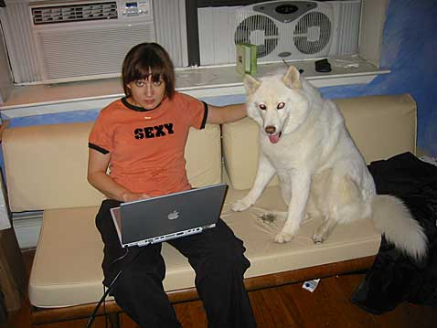
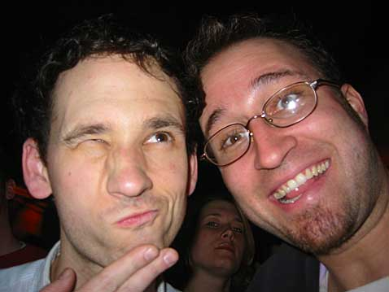
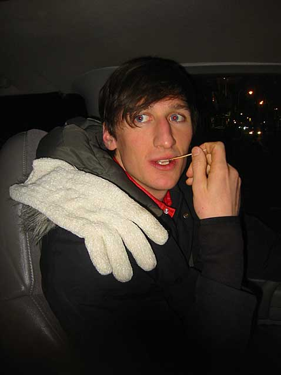
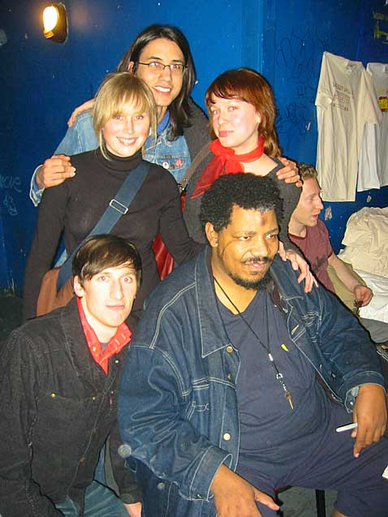
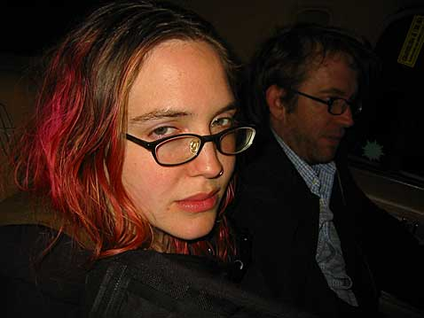
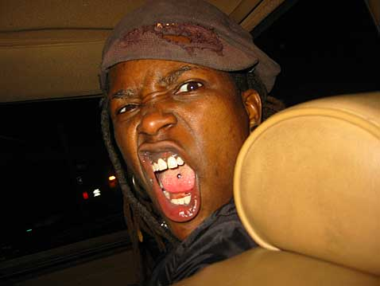
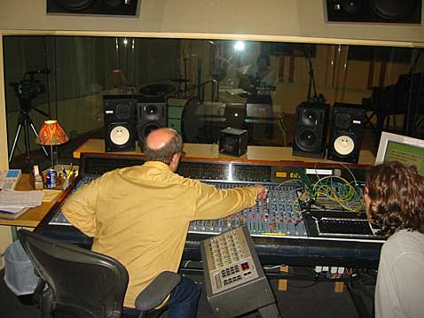
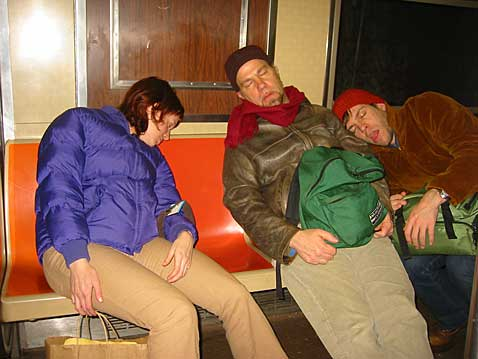
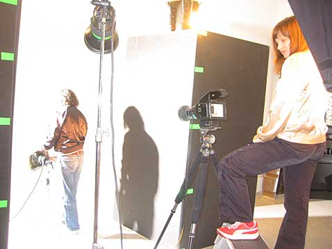
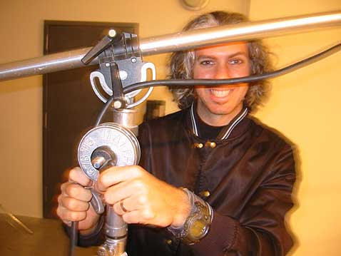

{ .polaroid loading=lazy }
Rachel and her doggie Raba.

{ .polaroid loading=lazy }
Me and Bobby (from The Love of Everything) at the Mercury Lounge. I saw him play, then the Prosaics and then Joan of Arc. Check out that girl lookin all bad-ass behind us.

{ .polaroid loading=lazy }
Kyle and Caithlin. And Cookie.

{ .polaroid loading=lazy }
Jason (from Mates of State) and the Hamburger Helper’s larger, scarier cousin.

{ .polaroid loading=lazy }
A shot with Wesley Willis after the show. I think he’s lookin at some girl’s ass.

{ .polaroid loading=lazy }
My friends Kari and Pete in a car goin to Brooklyn. After I took this picture, Kari’s eyes hopped out and strangled me to death.

{ .polaroid loading=lazy }
Crazy Shannon rode in the front seat.

{ .polaroid loading=lazy }
The next morning I woke up on a couch at Pete and Kari’s and built a closet with two total strangers. Actually they are Pete and Kari’s roommates. This is one of them, Anna. It’s her closet. Insert coming-out-of-the-closet joke here. Pat self on back for being so clever.

{ .polaroid loading=lazy }
Kevin and Eileen hanging out at Dubway, the studio where Kyle recorded his new record. Kevin is laughing at your coming-out-of-the-closet joke. Mock-laughing, that is.

{ .polaroid loading=lazy }
Mark Haines working the board at Dubway. You can sorta see Kyle through the glass.

{ .polaroid loading=lazy }
Everyone seemed to be sleeping on the F train after we left the studio, so we did the same.

{ .polaroid loading=lazy }
Here’s Rachel and B at work. They are getting ready to take a picture of Superman for an Adobe ad.

{ .polaroid loading=lazy }
This is the last thing I saw before I left New York. No, that’s not a moustache.
