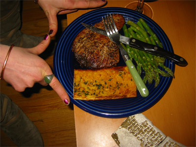
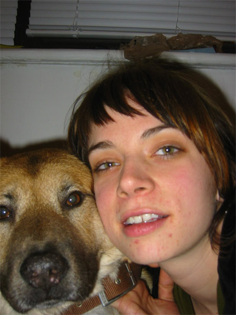
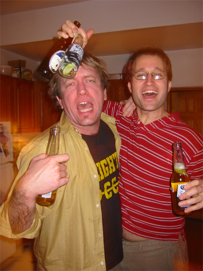

Obviously I don’t speak Spanish. Anyway I’ve at long last updated my diary. I migrated the whole thing from GreyMatter to MovableType, but you probly don’t give a damn about that. Anyway, I’m back. Gonna try to update this thing more regularly now that I’ve done this update. Hopefully all my old buddies will return and leave more comments about how gay I am.

Here’s some dorkass pictures I took recently.

{ .polaroid loading=lazy }

Here’s the badass lofty bed I made with some major help from my friend B. It’s super-solid AND it glows in the dork. I mean dark.

{ .polaroid loading=lazy }

Check out all that storage! Now to get me some dead bodies…

{ .polaroid loading=lazy }

Here’s the dinner I made last night. It’s kinda hard to tell, but that’s sesame seared tuna steak. And asparagus. And some store-bought garlic bread that wasn’t up to par. But the rest was so nummy.

{ .polaroid loading=lazy }

Here’s my friend Charlie who came over to have tuna steaks with me. That’s her dog Lil Star. Ain’t they cute?

{ .polaroid loading=lazy }

Later on my friend Peter showed up and we got some dance on. And some beers on.
