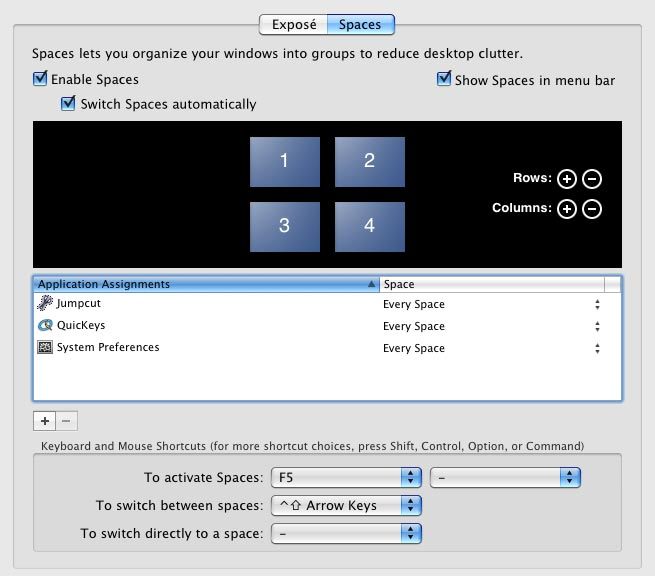

Like a [lot](http://blogs.sun.com/bblfish/entry/why%5Fapple%5Fspaces%5Fis%5Fbroken) of [folks](http://www.dribin.org/dave/blog/archives/2007/11/13/spaces/), I’m not quite happy with the implementation of Spaces in Leopard. Overall, I think it’s a beautiful solution, but as [Dave Dribin](http://www.dribin.org/dave/blog/archives/2007/11/13/spaces/) points out, Apple is trying to make an advanced feature accessible to the masses, and as a result, it doesn’t work very well for the folks who will likely use it most: power users.

Traditionally, making power user features accessible to regular users has been one of Apple’s fortés, and they’ve usually managed to do so while still maintaining the flexibility that power users require. With Spaces, however they’ve fallen short of that mark. It’s a new feature, so hopefully they’ll improve it with future updates. Here’s one way I think they could improve it dramatically.

{ .bordered }

The above screenshot shows the Spaces prefpane with one simple addition: a checkbox, selected by default, which reads "Switch Spaces automatically." With this checkbox on, Spaces would behave as it currently does, automatically switching Spaces when you switch to an app whose frontmost window is hidden in another space. (Perhaps they could smarten it up a bit so it wouldn’t automatically switch if the given app already has a window open in the current space, but I digress.)

With this checkbox off, Spaces would never switch spaces for you. Instead you would stay in the current space until **you decide to switch spaces yourself**, either by invoking the meta-view and clicking another space, or by using the modifier keys defined in the Spaces prefpane.

So suppose you’re in space 3 and all your currently-open Safari windows are in space 1\. If you switch to Safari, it would act as if there were no windows open and open a new one for you. So each space is truely like a new monitor, a new workspace, oblivious of its partners.

Let’s follow this through a bit more. There are certain window types that you’d want to have available in every space. For example, Safari’s Preferences window, or its Downloads window, or Mail’s Activity window. These would be useful to have in every space. But what if Safari’s Downloads window is already open in space 1, and you press Command-Option-L while in space 3? With auto-switching off, invoking any window that is already open in another space would **bring it to you** in the current space, rather than swooping you over to it. So if you’re in space 3 and you want to look at that Ebay auction item that’s open in some other space, you could choose the window from Safari’s Windows menu, or from Safari’s Dock menu, and it would swoop into view in your current space, keeping you in place, not disrupting your workflow or your context.

I think this simple change would go a long way toward making Spaces work for the power users who are most likely to get the most use out of it, while still keeping it simple and accessible for folks like my dear old Mom.

\[Hat tip to [@philoye](http://twitter.com/philoye) for thinking this through with me.\]

\[[Digg this story](http://digg.com/apple/A%5Fproposal%5Ffor%5Fimproving%5FSpaces%5Fin%5FLeopard)\]
