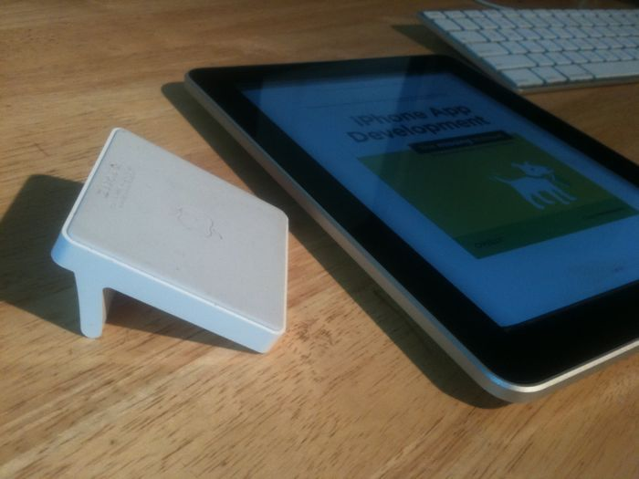
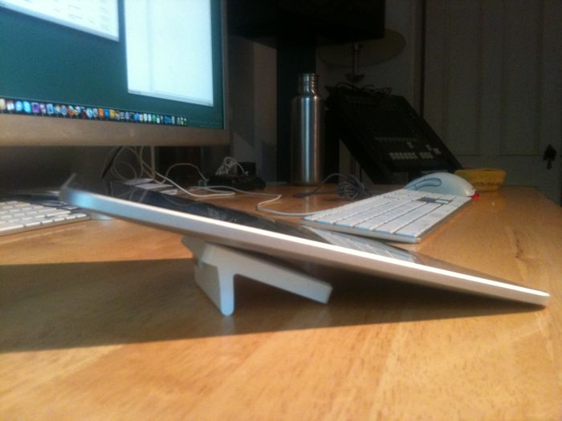
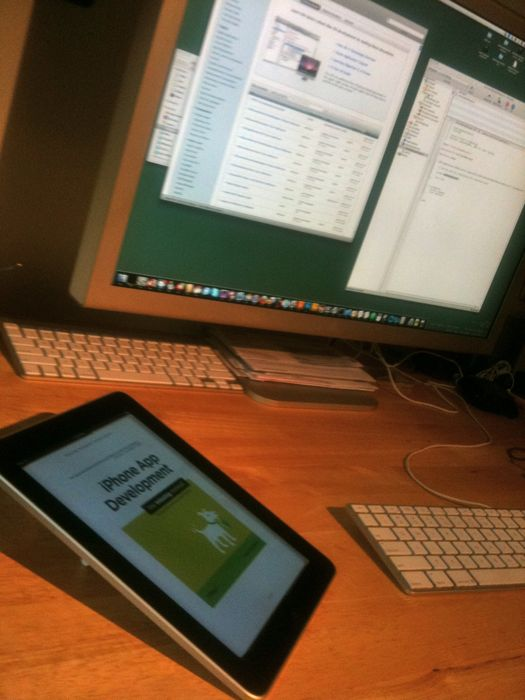

While working my way through the excellent [iPhone App Development Missing Manual](http://appdevmanual.com), I discovered that flipping Apple's iPad dock upside down makes for an excellent reading stand. The rubberized base does a good job of keeping the iPad in place when tapping from page to page, and the reading angle is much better than when using the dock in its pre-ordained fashion.

{: .polaroid }

{: .polaroid }

{: .polaroid }
