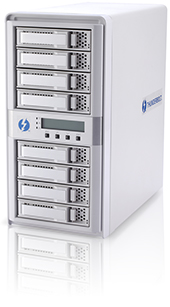
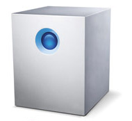
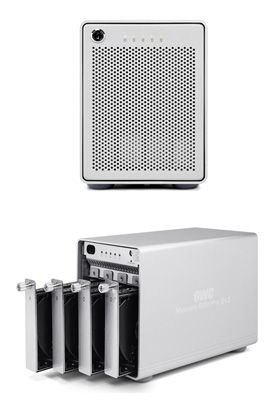

I've finally retired my aging Mac Pro tower. I bought the 8-core model in April 2007, and managed to keep it feeling quite snappy with a few upgrades along the way: 17gb of RAM, a 500mb SSD drive, and a new video card. I also retired my 30-inch cinema display from 2004.

While I'm considering making the leap to [the new Mac Pro tower](http://www.apple.com/mac-pro/) that should be released any day now, I'm currently using my 2011 MacBook Pro full-time, along with a 27-inch Thunderbolt display, and it's doing the job pretty well. (I installed the SSD from the old Mac Pro, and maxed the RAM at 16gb.) So I might stick with this and not bother getting the new Mac Pro.

The one thing I really miss is the three extra drive bays in the old Mac Pro. In the second bay I had a pretty fast data drive for my everyday projects and my large iTunes and iPhoto libraries. In the third bay, a really fast drive dedicated to Final Cut Pro projects. And in the fourth bay, a 3TB drive for Time Machine Backups. (I also use SuperDuper to backup my startup drive nightly; and after every Final Cut session, I'd backup my video drive to an external drive via a [NewerTech drive dock](http://www.newertech.com/products/voyagerq.php).

So now that I have a Thunderbolt-capable machine, I've been exploring the available options for getting all those drives online with my new rig. I'm looking for a simple drive expansion chassis, something that will allow me to use all these drives without having a stack of external enclosures and power cables cluttering my desk. Here's what I've found.

{ .polaroid .centered }

**Areca ARC-8050** – around $1450 empty At the top of the list, the [ARC-8050 by Areca](http://www.areca.us/products/thunderbolt.htm). This is an 8-bay minitower that supports every RAID level you can imagine, or you can use it as just a bunch of disks (JBOD). You can even mix and match, using some of the bays for a RAID config and others as independent disks. Final Cut guru Larry Jordan has written [a great review of the ARC-8050](http://www.larryjordan.biz/product-review-areca-8050-thunderbolt-raid/). Areca also makes [a similar device with just 4 bays](http://www.areca.us/products/thunderbolt5026.htm) for around $850.

While a fast RAID is great for video projects, that's not the problem I'm trying to solve right now. The ARC-8050 is a bit pricey, and sounds like it's a bit tricky to configure. I'm also not impressed with the very un-Mac-like software it ships with. And since I'm considering moving to a new Mac Pro in the near future, I'm going to keep my eyes on this company and see if they release a Thunderbolt 2 version with better software.

{ .polaroid loading=lazy }

**Drobo 5D** \- around $700 empty The [Drobo 5D](http://www.drobo.com/products/professionals/drobo-5d/) allows you to insert up to 5 drives and it stripes your data across all the drives for speed and redundancy. This is similar to RAID 5, but the Drobo requires basically no configuration, and lets you use drives of any size. The 5D is the first Drobo to support Thunderbolt. It also has a slot for an SSD card that accelerates transfer speeds. Here again, [Larry Jordan has an excellent review](http://www.larryjordan.biz/product-review-drobo-5d/).

I already own the original 4-bay Firewire Drobo, but it is painfully slow and unusable for day-to-day work, so I've retired it to service as a media storage device attached directly to my Airport wifi base station. It sounds like the 5D is considerably faster, even fast enough for multicam video editing. But again, right now, I'm really looking for a JBOD solution, so I'm going to pass on the new Drobo for now.

{ .polaroid loading=lazy }

**Blackmagic MultiDock** \- around $600 empty I find the [Blackmagic MultiDock](http://www.blackmagicdesign.com/products/blackmagicmultidock) very interesting. It offers four 2.5-inch bays in a 1U rackmount enclosure. It's designed to be used with really fast SSD drives, primarily for video editors. While I do have an audio rack next to my desk for rackmount devices like this, I'm just a video hobbyist and I don't have a stack of SSDs looking for a home. If BlackMagic or someone else made a version of this device that had 3.5-inch bays, I'd definitely be interested. And as SSDs get cheaper, I'll definitely give this another look.

{ .polaroid loading=lazy }

**LaCie 5big** \- around $1100 with 10TB The [LaCie 5big](http://www.lacie.com/us/products/product.htm?id=10607) is a 5-bay Thunderbolt device that ships pre-filled with five 2TB drives for $1100 (or you can get a 20TB version for $2100). However, it doesn't support RAID 5, which I'd like to have as an option in the future. It does support JBOD, which is what I'm looking for right now, but they don't make an empty version, so I'd be forced to buy drives that I don't need. So this device is a pass for me.

At long last, here's what I actually ended up buying:

{ .polaroid loading=lazy }

**OWC Mercury Elite Pro Qx2** \- around $280 empty The [OWC Mercury Elite Pro Qx2](http://eshop.macsales.com/item/OWC/M3QX2KIT0GB/) is a four-bay enclosure that supports RAID 0, 1, 5, and 10, or JBOD. However, this device is NOT a thunderbolt device. What?! Well, in doing all this research, I came to the realization that to really take advantage of the speed of Thunderbolt, you have to use RAID. Regular drives just aren't fast enough to saturate the channel. But I'm not doing 4K multicam editing, so I'm not concerned about achieving thunderbolt level speeds, and I don't want to set up a RAID device at this point. I just want a way to have these existing drives all attached to my MacBook without buying an enclosure and power supply for each one. This device does exactly that. The connectivity is Firewire 800 and USB 3\. It has an internal power supply, so there's no power brick to deal with. And it has a nice big fan, so it should be pretty quiet. (Small fans have to spin faster and are thus usually noisier.) And it's considerably cheaper than all the Thunderbolt options I found.

One concern is being able to use this device with the new Mac Pro should I decide to get one. The new Mac Pro has USB 3, so I might connect it that way instead, and [it might even be faster than Firewire](http://terrywhite.com/firewire-800-vs-usb-3-which-is-faster/). However, the OWC device only supports JBOD over Firewire, not USB. Fortunately, my Thunderbolt display provides a Firewire port, so if I want to continue using JBOD then I'll just connect it to the display.

It should arrive some time this week, so I'll update this article with my review of the device after I've spent some time with it.

If you have experience with any of the above devices, or if you have a Thunderbolt device you'd recommend to others, please let me know in the comments below.
