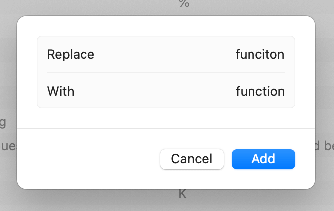

<script lang="ts">
  import Flipper from './Flipper.svelte'
</script>

I've noticed that a lot of React apps and tutorials define components using arrow functions rather than function declarations. I prefer the latter, but have been struggling to articulate why. So here's me thinking that through and trying to explain my preference, if only to myself.

## What am I talking about?

This is an arrow function component:

```typescript
const SomeComponent = (props: Props) => {
  return (
    <main>
      <h1>Hello world!</h1>
    </main>
  );
};
```

This is the same component as a function declaration:

```typescript
function SomeComponent(props: Props) {
  return (
    <main>
      <h1>Hello world!</h1>
    </main>
  );
}
```

They look pretty much the same, right? So what's the big deal?

---

# Reasons I prefer function declarations:

## More expressive

In any language, words have power and meaning. We use different words to help distinguish different types of things. If everything is a `const`, the word becomes overloaded and _loses_ meaning. Using `function` for React components makes it easier to distinguish components from other types of variables that we might declare using `const`.

## Components are important, variables are garbage

Using `function` for components and `const` for variables allows us to express an important distinction. Components are the building blocks of your application; they have a sort of permanence, a life of their own, subject only to their parent components. On the other hand, constants and other variables are more like the molecules and atoms of those building blocks, implementation details that can be discarded or garbage-collected when they are no longer needed.

## Consistent, predictable shape

There are at least three different 'shapes' for React components defined with arrow functions. Let's call them small, medium, and large:

<!-- prettier-ignore -->
```typescript
const SmallComponent = () => <main><h1>Hello world!</h1></main>;

const MediumComponent = () => (
  <main>
    <h1>Hello world!</h1>
  </main>
);

const LargeComponent = () => {
  return (
    <main>
      <h1>Hello world!</h1>
    </main>
  );
}
```

These are all doing the same thing, but with slightly different syntax and indentation. The small one has an implicit return of a single line of JSX. The medium one has an implicit return of slightly indented JSX. And the large one has a function closure with an explicit JSX return. Having different shapes for components often means reformatting when you need to make changes, like adding some state, for example. With function declarations, there is only one shape, with an explicit return and consistent indentation, so making changes or adding state is simpler and more predictable.

## Shorter syntax, really

Arrow functions are lauded for being shorter and easier to type than function declarations. That's true in a lot of cases, but for most React components, arrow functions are slightly longer!

<details open>
<summary>Comparison</summary>

<Flipper>

```typescript
const ComponentName = (props: Props) => {
  return (
    <main>
      <h1>Hello world!</h1>
    </main>
  );
};
```

```typescript
function ComponentName(props: Props) {
  return (
    <main>
      <h1>Hello world!</h1>
    </main>
  );
}
```

</Flipper>

</details>

Look ma, one less semicolon!

Here's another comparison, this time with some internal `const` declarations.

<details open>
<summary>Comparison</summary>

<Flipper>

```typescript
const ComponentName = (props: Props) => {
  const name = props.name ?? 'there';
  const action = getAction(props.user);
  return (
    <main>
      <h1>Hello {name}!</h1>
      <p>{action}</p>
    </main>
  );
};
```

```typescript
function ComponentName(props: Props) {
  const name = props.name ?? 'there';
  const action = getAction(props.user);
  return (
    <main>
      <h1>Hello {name}!</h1>
      <p>{action}</p>
    </main>
  );
}
```

</Flipper>

</details>

I find having the component declared using `function` makes it much easier to distinguish between the component and its contents, versus the somewhat confusing 'stack of consts' in the arrow function version, which at first glance looks like an indentation error.

## Consistent export behavior

To export a component, you use the `export` keyword:

```typescript
export const SomeComponent = (props: Props) => {
  ...
};
```

If you want to define an arrow component as the default export using the `default` keyword, you might try this:

```typescript
export default const SomeComponent = (props: Props) => {
  ...
};
```

But that will trigger a parsing error. Instead, you have to do it in two parts:

```typescript
const SomeComponent = (props: Props) => {
  ...
};

export default SomeComponent;
```

With a function declaration, you can do it all together:

```typescript
export default function SomeComponent(props: Props) {
  ...
}
```

Granted, it's generally considered best practice to avoid default exports and only use named exports, but for those occasions where you do need a default export, the arrow function version is longer and kinda clunky. The function declaration version also keeps that default export near the top of the file, which I prefer.

## These days, `this` isn’t a problem

Once upon a time, the concept of `this` was the bane of many React developers. Long story short, classes and functions have a _context_ referred to as `this`. Before functional React, when most React components were defined as classes, you often needed to call `this.someMethod()` on your component. Declaring functions inside class components was problematic, because `this` inside those functions would no longer refer to the parent class. Arrow functions eased this pain, by allowing us to create anonymous 'context-free' functions where `this` would be inherited from the parent scope.

Nowadays, most React development has moved away from class components and lifecycle methods, toward functional components and hooks, so we almost never need to even think about `this`, much less type it. So that's one less reason to favor arrow functions over function declarations, for React components.

---

# Functions are verbs, components are nouns

In React apps I like to delineate four types of function declarations:<br/>
_Helpers, Handlers, Hooks, and Components._

**Helpers** use camelCase names that describe what they do, starting with a verb, sometimes followed by a noun:

```typescript
function getUserName(user: User): string {
  return user.name.full;
}
```

**Handlers** use camelCase names starting with `on` followed by some verb, and are used to handle user events or react to some change in state.

```typescript
function onClick(event: MouseEvent) {
  alert('You clicked!');
}
```

**Hooks**, as you probably know, use camelCase starting with the verb `use` followed by some noun.

```typescript
function useAlert() {
  const { alert } = useContext(AlertContext);
  return alert;
}
```

And **Components** are nouns that use TitleCase names and render JSX:

```typescript
function UserProfile({ user }: Props) {
  return (...);
}
```

Admittedly it's a little weird that I like to use the `function` keyword for declaring these three types of "verbs" as well as this one "noun". But to me, the TitleCase naming and the destructured-props function signature are enough of a distinction from those other types of functions, and I find it more helpful that the `function` keyword lets me distinguish Component declarations from other variables declared with `const`.

Here's another way to think of it. Component functions _are_ verbs, and they _are_ camelCase, starting with the verb 'render' followed by some TitleCase noun. Except the verb 'render' is invisible! It's implied, so `renderComponent` just becomes `Component`.

---

# I suck at typing `function` too

Pro-tip: use text replacements to auto-fix common misspellings of this critical keyword.

<figure>

{ .polaroid width=400 style=margin-top:0 }

_Won't you take me to… funciton_

</figure>

Sadly VSCode doesn't seem to honor those, but [we can use snippets](https://code.visualstudio.com/docs/editor/userdefinedsnippets) to do the same thing. Even better, we can define a snippet for a typical React function declaration with export, destructured props, Typescript annotations, etc. Here's one to get you started:

```json
	"React Functional Component": {
		"prefix": "rfc",
		"description": "React Functional Component",
		"body": [
			"import { ReactNode } from 'react';",
			"",
			"export interface ${TM_FILENAME_BASE}Props {",
			"  children: ReactNode;",
			"}",
			"",
			"export function $TM_FILENAME_BASE({ children }: ${TM_FILENAME_BASE}Props) {",
			"  return <>{children}</>;",
			"}",
			""
		],
	}
```

---

# When I like to use arrow functions

Anonymous arrow functions have their uses, of course.

## Array helpers

```typescript
const user = users.find(u => u.id === currentUserId);

const activeLocations = user.locations.filter(location => location.active);

const activeLocationNames = activeLocations.map(location => location.name);
```

## useEffect, useCallback, and useMemo callbacks

```typescript
useEffect(() => {
  console.log('Username changed', username);
}, [username]);
```

## JSX maps

```typescript
export function List({ items }: ListProps) {
  return (
    <ul className="list">
      {items.map(item => (
        <ListItem key={item.id} {...{ item }} />
      ))}
    </ul>
  );
}

function ListItem({ item }: ListItemProps) {
  return (
    <li>
      <span className="icon">{item.icon}</span>
      <span className="name">{item.name}</span>
    </li>
  );
}
```

This example touches on the top-down, single-responsibility component style that I also prefer to use, with a main component at the top of the file that is as simple as possible, delegating responsibilities and implementation details to other components, which might be child components further down in the same file, or shared components imported from somewhere else. I wrote more about this in [an earlier post](/diary/2023-09-08-thoughts-on-react).

---

# ESLint to the rescue

If you use [eslint](https://eslint.org/) (you should), you can add [eslint-plugin-react](https://github.com/jsx-eslint/eslint-plugin-react/) (you might already have it), and then add this to your eslint config rules:

```eslint
'react/function-component-definition': [
  'error',
  {
    namedComponents: ['function-declaration'],
  },
],
```

Then you can run `eslint --fix src` and it will convert all your arrow function components to function declarations. You can set the first param to 'warn' if you'd like to migrate your codebase more gradually. You can also set the rule to 'arrow-function' if you'd like to ignore everything I just said and use arrow functions for all your components. Fine, be that way. Read more about [this handy eslint rule](https://github.com/jsx-eslint/eslint-plugin-react/blob/master/docs/rules/function-component-definition.md).

# In conclusion

Opinions are like assholes, especially my opinions.

I care, but not really, it's cool, whatever.
