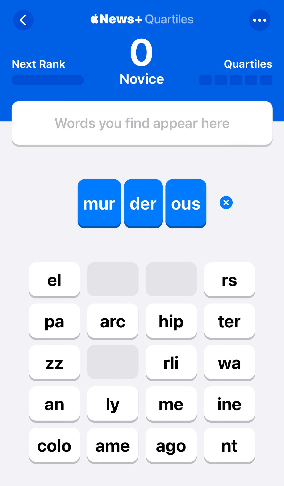

<script lang="ts">
  import IteratorDemo from './IteratorDemo.svelte';
  import TrieDemo from './TrieDemo.svelte';
  import TrieOutline from './TrieOutline.svelte';
  import QuartileInput from './QuartileInput.svelte';
  import { findCombinations, americanEnglishDictionary, scrabbieDictionary, findWords } from './find-words';

  const emptyTokens: string[] = new Array(20).fill('');
  const todayTokens = 'el-ous-mur-rs-pa-arc-hip-ter-zz-der-rli-wa-an-ly-me-ine-colo-ame-ago-nt'.split('-');
  let tokens: string[] = [...emptyTokens];
  $: combinations = findCombinations(tokens);

  function prefillParts() {
    tokens = [...todayTokens];
  }

  function prefillParts2() {
    tokens2 = [...todayTokens];
  }

  let trieTime = '';

  let tokens2 = [...emptyTokens];
  $: words2 = findWords(tokens2);
</script>

Lately I've been playing a game in the Apple News app called Quartiles. The game presents 5 rows of 4 scrambled word parts, and the goal is to arrange one to four of the parts to assemble words, scoring points for longer words.

<aside style="--aside-span: 4;">
<details open>
<summary>Quartiles</summary>

{ .bordered loading=lazy width=90% style="border-radius: 8px" }

</details>
</aside>

Each puzzle includes around 25-30 words, and once you reach 100 points the game congratulates you. But I found myself obsessively trying to find every single word, and then I got the idea to build a solver.

## First, build a form.

<QuartileInput bind:tokens/>

## Then figure out how many possible combinations there are.

<aside style="--aside-span: 9">
<details open>
<summary>find-combinations.ts</summary>

```typescript
export function findCombinations(tokens: string[]): string[] {
  const uniqueTokens = tokens.filter(Boolean);
  let combinations: string[] = [];

  for (let i = 1; i <= 4; i++) {
    combinations = [...combinations, ...generateCombinations(uniqueTokens, i)];
  }

  return combinations.sort();
}

function generateCombinations(tokens: string[], length: number): string[] {
  if (length === 1) {
    return tokens;
  }

  let combinations: string[] = [];
  for (let i = 0; i < tokens.length; i++) {
    const token = tokens[i];
    const remainingTokens = tokens.filter(t => t !== token);
    const remainingCombinations = generateCombinations(remainingTokens, length - 1);
    combinations = [...combinations, ...remainingCombinations.map(c => token + c)];
  }
  return combinations;
}
```

</details>
</aside>

To find all the possible combinations of those word parts, in groups of 1 to 4, I came up with a `findCombinations` function, with a little help from Copilot. Try typing some unique word parts into the form and see the number of possible words that can be made from those parts. Or <button class="link" on:click={prefillParts}>auto-fill it</button> with today's puzzle. Go on, I'll wait.

{#if combinations.length !== 123520}

<div class="breakout-left" style="max-width: 450px; border-left: 2px solid grey; padding-left: 1rem;">

The rest of this article won't really make sense until you <button class="link" on:click={prefillParts}>fill that form</button> with 20 unique word parts.

</div>

{/if}

{#if combinations.length > 0 && combinations.length < 123520}

Combinations: {combinations.length.toLocaleString()}

{/if}

{#if combinations.length === 123520}

Wow, {combinations.length.toLocaleString()} possible words!

{/if}

## Next, just compare those combinations with a word list.

Simple! Or not.

First, I downloaded the `scrabble-dictionary.txt` from some Github repo. It contains {scrabbieDictionary.length.toLocaleString()} words. So I naively thought I could just loop through my combinations and filter them using the dictionary:

<div>

<!-- prettier-ignore -->
```typescript
const words = combinations.filter(
  combination => dictionary.includes(word)
);
```

</div>

I was hoping to show the matching words in real-time as I fill out the form, but when I ran that filter with more than just a few word parts it basically crashed my browser.

So I did a bit of research into running large javacript tasks without blocking the main thread. The most common suggestion is to use a web worker (or a service worker), but I also stumbled across (that is, found on Stack Overflow) an `iterator` solution that breaks the job up into separate tasks (e.g. one task for each combination) and calls each one with a setTimeout.

{#if combinations.length !== 123520}

<div class="breakout-left" style="max-width: 450px; border-left: 2px solid grey; padding-left: 1rem;">

The rest of this article won't really make sense until you <button class="link" on:click={prefillParts}>fill that form</button> with 20 unique word parts.

</div>

{/if}

<IteratorDemo wordList={scrabbieDictionary} {combinations} />

<aside style="--aside-span: 3;">
<details open>
<summary>iterate.js</summary>

```javascript
function iterate(from, to, action, complete) {
  let i = from;
  let canceled = false;
  const runAction = () => {
    action(i);
    i++;
    if (i < to && !canceled) {
      setTimeout(runAction, 1);
    } else {
      complete();
    }
  };
  runAction();
  return () => {
    canceled = true;
  };
}
```

</details>
</aside>

I let it run all the way to completion once, and it took around 4 minutes. The use of so many `setTimeout` calls probably causes the task to take much longer than the thread-blocking browser-crashing version. Regardless, this was clearly no way to provide real-time feedback on the number of found words as the form is filled out.

I thought maybe I should find a shorter word list. The Scrabble dictionary contains a lot of words, many of which nobody ever uses, let's be honest. So I found an npm package called [`is-word`](https://www.npmjs.com/package/is-word) that has a few different dictionaries, one of which is a list of American English words. Filtering out all the proper nouns in that list yielded {americanEnglishDictionary.length.toLocaleString()} words. Still way too many to make a dent in the processing time.

While poking around in the source of that package, I noticed it was using a `Trie` construct for checking words. I never properly studied computer science, so while I had heard of tries (trees? try's? triés?), I had never used them, or had a need to. So as a learning I cribbed from there and ported the Trie idea into typescript.

<aside style="--aside-span: 12;">
<details open>
<summary>Trie.ts</summary>

```typescript
class TrieNode {
  end = false;
  children: Record<string, TrieNode> = {};
}

export class Trie {
  root = new TrieNode();

  insert(word: string) {
    let node = this.root;
    for (let i = 0; i < word.length; ++i) {
      if (node.children[word[i]]) {
        node = node.children[word[i]];
      } else {
        node.children[word[i]] = new TrieNode();
        node = node.children[word[i]];
      }
    }
    node.end = true;
  }

  check(word: string) {
    if (this.root == null) return false;
    let node = this.root;
    for (let i = 0; i < word.length; ++i) {
      if (!node.children[word[i]]) return false;
      node = node.children[word[i]];
    }
    return node.end === true;
  }
}
```

</details>
</aside>

To use it, you first loop through your word list and insert each word into the trie:

<div>

```typescript
const trie = new Trie();
americanEnglishDictionary.forEach(word => trie.insert(word));
```

</div>

Then you can call `trie.check(possibleWord)` to see if there's a match. So let's try that with our {combinations.length.toLocaleString()} combinations.

{#if combinations.length !== 123520}

<div class="breakout-left" style="max-width: 450px; border-left: 2px solid grey; padding-left: 1rem;">

The rest of this article won't really make sense until you <button class="link" on:click={prefillParts}>fill that form</button> with 20 unique word parts.

</div>

{/if}

<TrieDemo wordList={scrabbieDictionary} {combinations} bind:timeElapsed={trieTime} />

{#if trieTime}

Wow, that was fast!

## How is that possible?

Let's try adding a few words to an empty trie object and see what it does with them. Try a few simple words like `pit`, `pitch`, and `pitcher`.

<TrieOutline wordList={scrabbieDictionary} />

You can see that it's breaking each word up into its constituent letters and creating a tree-like outline of each word, with each subsequent letter nested as a child inside the previous letter. Each 'leaf' in the tree is also marked with an `end` property, indicating whether there is a valid word that ends on that leaf. For example, the `t` has `end: true` because pit is a word, while the `c` has `end: false` because pitc is not a word. And the `h` and `r` have `end: true` because pitch and pitcher are words.

Once the trie is populated with words, we can call `trie.check` to see if a word exists. The `check` method (see the `Trie.ts` file above) loops through each letter in the word, navigating down the outline of registered words. If there is no leaf for a given letter, it returns false. If it finds a leaf for every letter, it then returns true if the last leaf has `end: true`, indicating that there is a valid word with all those leaf characters in that order.

It seems somewhat counter-intuitive to me that this method could be so much faster than the naive approach I originally took. But the results don't lie.

Try filling out this Quartile form with random word parts and see how quickly it's able to find all the possible valid words. Or <button class="link" on:click={prefillParts2}>auto-fill it</button> with today's puzzle.

<QuartileInput bind:tokens={tokens2}/>

{#if words2 && words2.length > 0}

  <details open>
    <summary>Words: {words2.length}</summary>
    <div class="words">
      {#each words2 as word}
        <div>{word}</div>
      {/each}
    </div>
  </details>
{/if}

{/if}

<style lang="less">
  aside {
    border-left: none !important;
    margin-inline: 0rem !important;
    padding-inline: 1rem !important;
  }

  .words {
    margin-top: 0.5em;
    justify-content: center;
    display: flex;
    flex-direction: row;
    flex-wrap: wrap;
    gap: 1rem;
    max-width: 600px;
    line-height: 1;
  }
</style>
