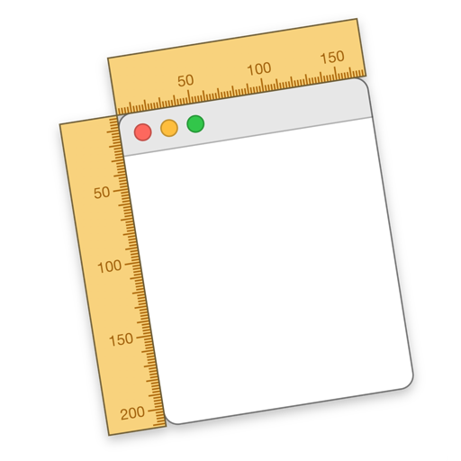
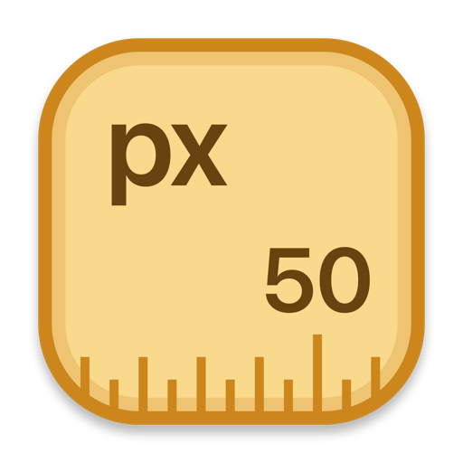

At long last, I’ve released a new version of [Free Ruler](/freeruler/).

It’s been over two years since I worked on the app because I got an App Store rejection that was really vague and I didn’t feel like dealing with it.

But this weekend, I decided to pick it up again with a little (or a lot) of help from Codex. I made a ticket to address the App Store rejection, and then had Codex analyze the app and make a series of tickets for possible improvements. Then I worked through those issues, with Codex doing most of the grunt work.

{ loading=lazy width=384 style="max-width: min(100%, 32rem); display: block;" }

One thing I knew was sorely needed was an icon update. The previous icon was created using a custom `AppIconLayout` in the app itself, leveraging the ruler drawing code so the rulers on the icon were faithful to the real thing. I decided to use a more modern version of that same technique, creating a parameterized SwiftUI preview so I could use a modified version of the ruler drawing code to create the new icon.

{ loading=lazy width=384 style="max-width: min(100%, 32rem); display: block;" }

Then I had Codex create a script to generate the full set of app icon assets so the app can consume them at build time, by typing `yarn generate:icons`. So tweaking the icon and updating the assets is super easy and repeatable. SwiftUI as Photoshop.

Then I went a little kookoo and applied the same technique to create updated promo images for the App Store.

<AppStoreCarousel slides={appStoreSlides} />

These are created with more parameterized SwiftUI previews, leveraging real ruler views and the `AppIconRenderer`. So if I change the app icon or ruler views, the promo images will update automatically. All I have to do is run `yarn generate:screenshots` to update the images.

## Other features and improvements

- Added `H` and `V` hotkeys to toggle horizontal and vertical rulers on and off.
- Added a status bezel to confirm hotkey actions like grouping, floating, or toggling ruler shadows.
- Better grouping behavior for horizontal and vertical rulers.
- More reliable cursor handling while interacting with rulers.
- Smarter mouse tick polling so the app does less background work.
- Refactored tick layout and ruler drawing internals.
- Added unit tests for core ruler behavior and UI tests for ruler actions, option hotkeys, and window behavior.
- Updated localized strings, and added Japanese and Spanish localizations submitted by other contributors.
- Added [Sparkle](https://sparkle-project.org/) so the direct-download app can check for updates automatically.

## Finally got through App Store review

I submitted the updated app to the App Store on Sunday, and got another vague rejection. Undeterred, I re-submitted today, a few hours before the WWDC keynote, and got approved in just hover an hour, with no comments. 🤷‍♂️

If you need a ruler for your Mac, download Free Ruler from [GitHub](https://github.com/pascalpp/FreeRuler/releases) or the [App Store](https://apps.apple.com/us/app/free-ruler/id1483172210?mt=12).
