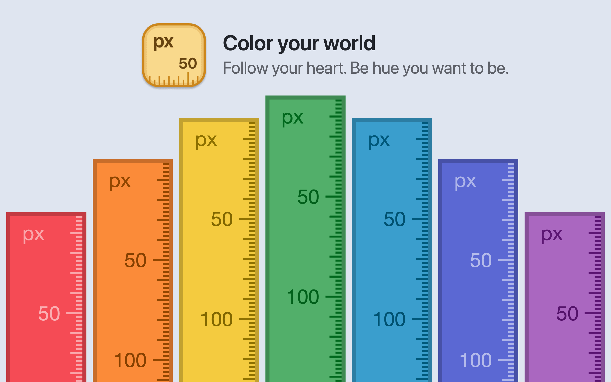

## Happy Pride Month!

Just in time for halfway through Pride Month, [Free Ruler](/freeruler/) now supports custom colors. This was an oft-requested feature that I've been meaning to add for a while. Really happy with how it turned out.

{: .polaroid loading=lazy width=1200 }

You can download Free Ruler from [GitHub](https://github.com/pascalpp/FreeRuler/releases) or the [App Store](https://apps.apple.com/us/app/free-ruler/id1483172210?mt=12).
