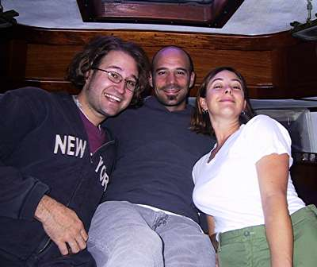

title: Birthday ruminationseses
date: Sunday, December  9, 2001 · 9:30am
---

Well, today is my birthday, making me thirty-one. I guess actually it’s almost over. I am in a boat called Willow, which belongs to my good friends Nick and Valerie. We are anchored in the Herb river, a little feeder to the Savannah River. Tomorrow we are going to get the fridge fixed and then we’re going shopping.

We have been eating well and passing the time easily. Tonight there is a bit of wind, and the snubber rope which is tied to the anchor chain is creaking and complaining just outside my cabin in the vee berth, in the front of the boat. Now the wind is even whistling in the rigging a bit. We are flying the flag of Georgia, I think i can hear it flapping.

Today we mounted the refrigerator compressor on a couple of brackets on the engine and made sure the belts were going to line up properly. It was interesting work, in a small space, not something I’m used to. But certainly I will have to get used to it if I’m ever going to have a boat of my own. The jury is still out on that one.

When I realized I was thirty-one, when I mouthed the words this morning, I felt a sudden dizziness, but i think maybe the boat had just rolled a bit.

Now I’m going to sleep, and tomorrow I will be thirty-one and a day.
