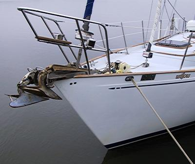
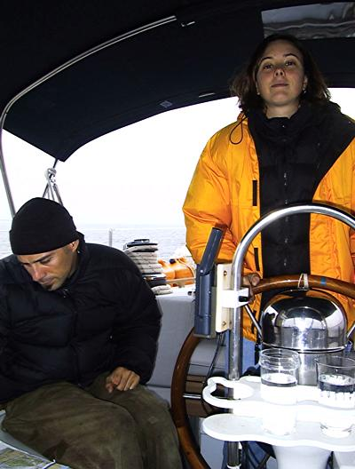
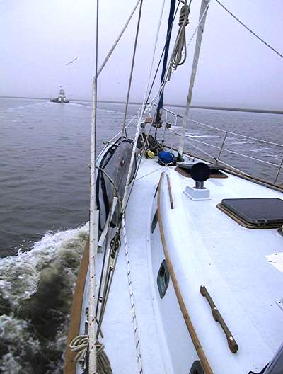

### “C’mon, Willow. let’s go to Florida.”

Today it is really foggy. We anchored overnight in Queen Bess Creek not too far south from Moon River, and after a breakfast of eggs and grits we are making our way south along the ICW.

The visibility is pretty limited, so we slowed a bit near a channel marker to look over the charts and avoid going aground with the tide going out. Approaching us from astern was a tug pushing a sizeable barge. i suggested that we follow the barge down the channel, since the tug captain would probably be pretty familiar with these waters. We were trying to pick her name off the side as she passed, and just as we made out ‘Nicole Guidry’ the tug captain comes in over the radio and in a nice buttery drawl invited us to follow him down river. We all donned big smiles and Nick radioed back, “We’re right behind you.”

