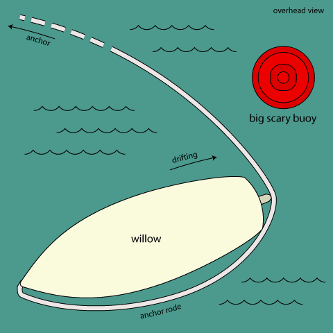

Well, today we had a pretty harrowing experience.

We anchored overnight near Fernandina Beach, Florida. The anchorage was pretty exposed and there were several other boats anchored nearby, so we put out two anchors off the bow. one was a 60 pound CQR, which is kind of heart-shaped, and the other was a fortress, which has big flat flukes.

After dropping the CQR with about 150 feet of chain and backing down on it, we put the fortress in the dingy and dropped it astern, behind the boat, with about 20 feet of chain and buncha buncha rope. So instead of swinging in one big circle around one anchor, the boat only really moves around in the intersection of the circles created by the two anchors. That’s the idea, anyway.

So this morning we decide to pull up our anchors and continue south. We let out a lot of rope on the second anchor so we could pull up the chain on the first anchor. Once we got it up, we started to motor around to pull up the second anchor. I was at the stern taking up the slack in the rope as we drifted back toward the anchor, making sure it couldn’t get under the boat and foul our propeller. Nick was at the bow taking in the line as i passed him the slack, and Valerie was at the helm.

The wind and current were playing against each other, and the boat starts to drift across the anchor rode (rope). Since we can’t bring the rope over to the other side of the boat (with the mast and rigging in the way) we had no choice but to put the engine in neutral and drop the line over the side, letting out enough slack so that hopefully the rope would go under the keel and come out on the other side.

At this point, we were drifting dangerously close to a large red metal buoy, which could do some serious damage to the sides of the boat if we were to hit it. But you certainly don’t want to put your propellor in gear if you know there’s a line somewhere under your boat.

Here’s a silly diagram to help you understand our little predicament:

Finally the line appears, and it’s still trapped on the wrong side of the boat, caught on the outer edge of the rudder which sits right behind the prop. We’re all real nervous and strained and pretty frantic at this point, but Nick makes the decision to put the boat in gear and motor away from the buoy which is getting closer and closer. It’s the right decision, as the rudder keeps the line clear of the prop and we were able to maneuver into a better location and bring up the anchor.

We all breathed a big sigh of relief and I took a nap.
