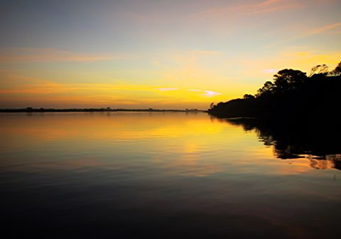
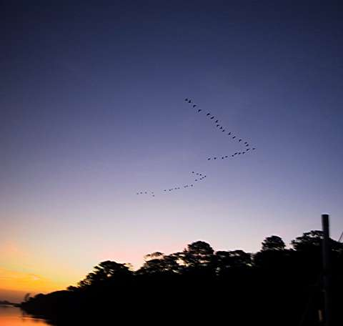
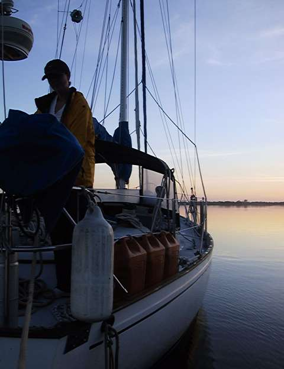
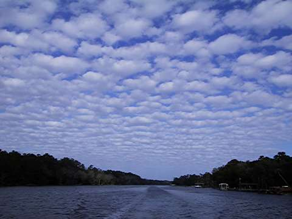
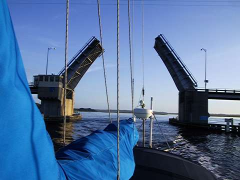
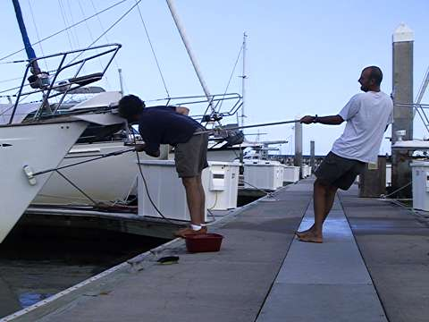

I think today we’ll just look at some pictures.

Just before sunrise on the Fort George River where we anchored last night.

Some kind of birds migrating south. Of course they may have been lining up to spell ‘Willow’, but we didn’t have time to stick around and find out.

Valerie handling lines on the stern as we prepare to leave Fort George River.

Pretty clouds.

Passing through one of the many drawbridges on the ICW.

Nick holds me out of the drink while i give the topsides a scrub.
