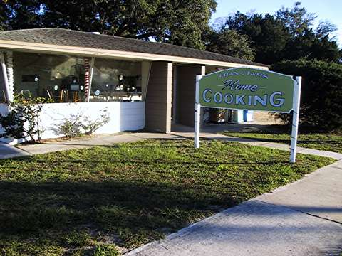
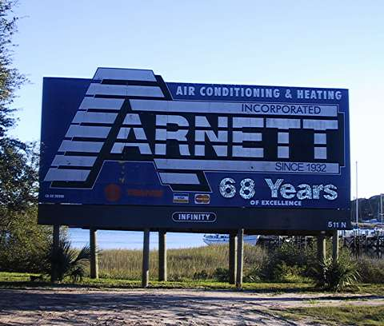
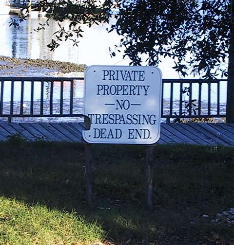
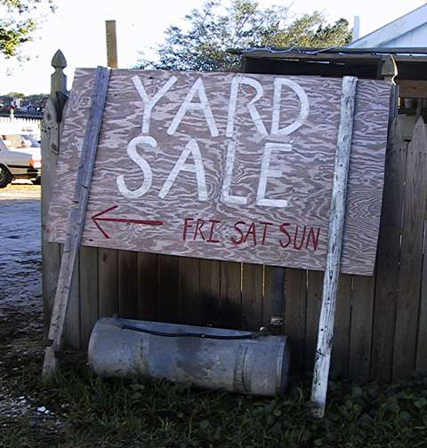

Today we took a walk through St. Augustine to Florida Route 1.

{ .polaroid }

We walked about a mile and a half to get to West Marine and buy some boat stuff. Here’s some of the signs we saw along the way.

{ .polaroid }

You would think this place would have real good food and be real popular with the locals, but it was completely empty. i guess maybe Fran and Tam were at home, cooking.

{ .polaroid }

Ooh, sparkly. i’m a sucker for signs with those shimmery mirror things. One thing though, if you do the math, it’s been 69 years. I guess they blew their ad budget on all them sparklies and can’t afford to swap the 8 for a 9.

{ .polaroid }

This sign says poh-poh. I like saying poh-poh.

{ .polaroid }

Mmm, suh-weeet peaches. Funny thing, though. There wasn’t a fruit stand anywhere near this sign. I think maybe it was just promoting the general idea of sweet peaches, watermelon, and canteloupe.

{ .polaroid }

This sign is not very friendly.

{ .polaroid }

I wonder what happens if the red light goes on and nobody calls?

{ .polaroid }

This sign wasn’t pointing at a yard sale. It was kind of pointing at the water. I wonder if it was a trick to try and get little old ladies who like yard sales to fall in.
