
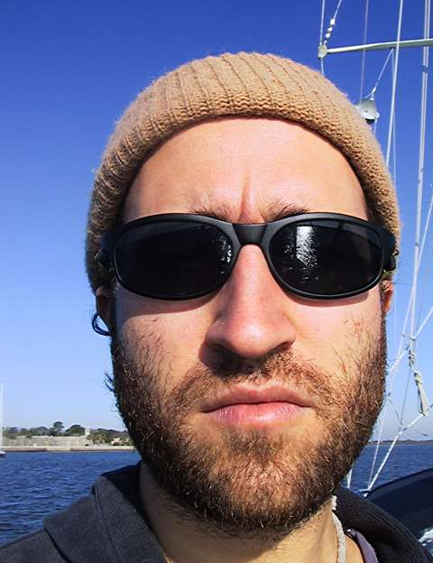

So yeah, the beard is comin in pretty good I’d say. Yeah, I didn’t know I was growing a beard either. It just sort of happened.

Today, I was at the helm all alone for a few hours while Nick and Valerie tended to some things below. I was taking the boat through the channel markers down the Indian River, waving at folks in boats heading in the other direction as we passed each other. Before too long, I began to imagine a certain admiration coming from them, and I began to allow myself to believe that they assumed me to be some young salt, single-handing a 44-foot boat all alone around the world. Perhaps my beard told them that I’d been at sea for a month or two, and having just made the long passage from the northeast or maybe some even colder, more remote locale, this burly lad decided to take a few days rest and motor down the ICW for a stretch before hopping out across the gulf stream, back into the roiling Atlantic.

Then of course Nick came up to relieve me at the helm and all that went away.

Some more pictures, some rambling thoughts:

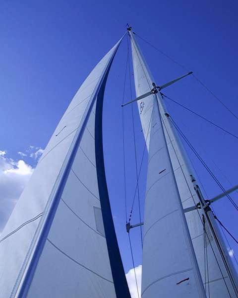

Here’s Willow with her sails up, at last we really got to sail her a bit. She doesn’t need much wind to get a nice move on.

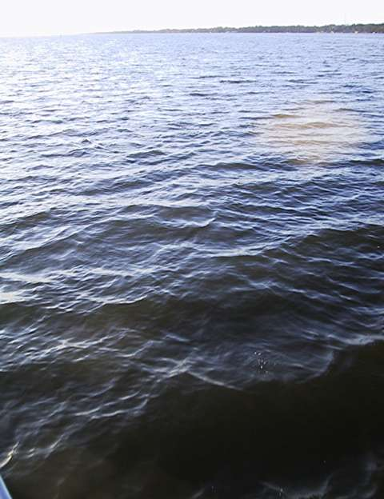

The dolphins have been toying with me for days now. They surround us daily, idly arching their backs through the surface of the water, poking their fins into the sunlight. For the most part they keep their distance, but occasionally they play in our bow wave or in our wake. But everytime I fumble for the camera to get a picture of them, they rapidly disappear. I swear there was a dolphin in this picture right before I took it.

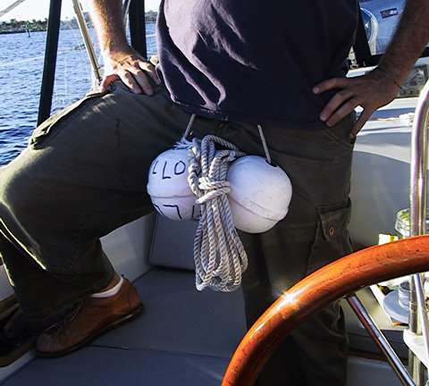

Apparently if you spend too much time at sea, you can come down with some pretty gnarly illnesses. Here’s me after I came down with a bad case of boat genitals.

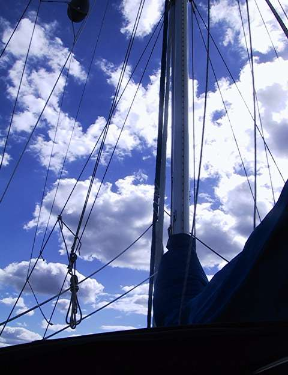

I have been fascinated with the clouds lately, I can’t stop taking pictures of them.

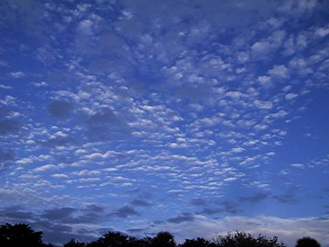

More pretty clouds.

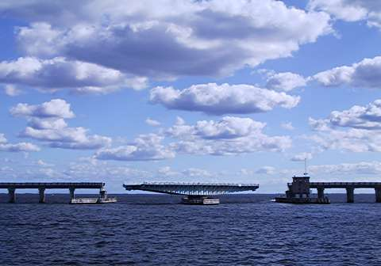

Most of the bridges on the ICW are bascule (draw) bridges, with sections that are raised and lowered to allow boats to pass. But a few of them, like this one, are swing bridges, with whole sections of roadway that swivel on a point, making way for passing boats. This is really amazing to watch. And of course, still more pretty clouds.

Tonight we took up a mooring in Vero Beach, Florida, where we ran into Colin and Colleen on Mandalay. They are some friends that Nick and Valerie met over the summer on their trip north to the Chesapeake. We had a nice little stroll through town tonight and we went out for pizza along the beachfront.

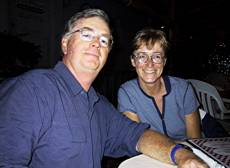

Colin and Colleen

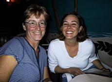

Colleen and Valerie

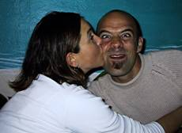

Valerie and Nick

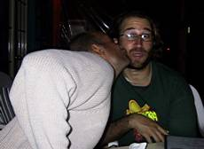

Nick and Pascal

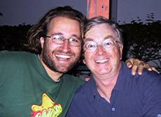

Pascal and Colin

It looks like we’ll be having a little Christmas potluck with Colin and Colleen. Look for another entry sometime shortly after Christmas.
