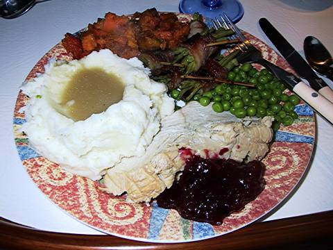
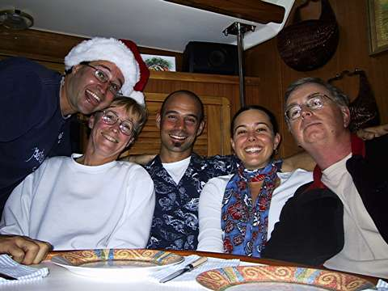

Merry Christmas!

Santa gave me a shave and a haircut.

We were about to go on a morning walk when we noticed that some secret santa had tied stockings to one of our lifelines and stuffed them with all kinds of goodies! At first, we didn’t know where they’d come from but then with some basic deductive reasoning we figured out that it was colin and colleen.

I ate my foil-wrapped orange and my box of chocolates and my jelly beans all in one sitting. I also got some miscellaneous bits of boat hardware but that was less edible than the other stuff.

After our little walk, I wrapped a bunch of bacon around a bunch of string beans into cute little bundles like my mommy taught me how to do. We’re also making mashed potatoes and candied sweet potatoes and homemade cranberry sauce. We’re gonna go eat with Colin and Colleen on their boat Mandalay. They’re making a turkey and gravy and trifle for dessert. Nummy.

Later…

Oh man. Dinner’s done and i’m stuffed. Everything was so wonderful, the food, the conversation, the anchoring stories. I didn’t miss my family at all. Well, maybe a little.

It’s strange, though. About 48 hours ago I didn’t know colin and colleen from adam and eve, but now I feel so close to them. I’m not sure what it is, it just seems that when a small group of strangers who are miles from anyone they know are thrust together, you rapidly overcome the barriers to intimacy that most people (myself included) put up when dealing with new aquaintances. By the end of the evening we were freely conversing about KY Jelly and enemas and other such holiday fare.

Oh, but you know, we did knock back a bit of alcomohol. Hot buttered rums, some white wine, and a little after dinner liqueur, Nassau Royale. So maybe it’s no wonder our tongues got a little loose.

