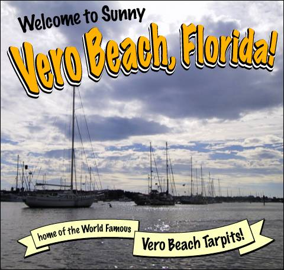
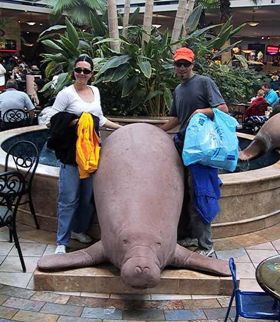
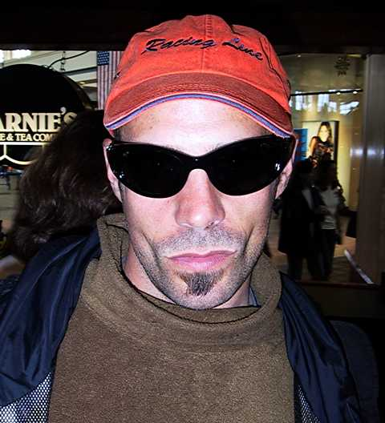

So we’re still in Vero Beach, Florida.

We thought we were only going to be here a day, then we decided to stay til the day after Christmas, and now we’ve been here for nearly a week. Our next stop is Fort Lauderdale, which is only two days away, and once we get there we’ll be stopping a while to do some work on the boat. But since the moorings here at the city marina are cheap, only $8 a day, we’ve decided to stay a bit longer and do some of the work here. One fellow described this place as the “Vero Beach Tarpits” — easy to get in, difficult to leave.

And with good reason. In addition to being a cheap place to stay, there is easy access to lots of stores and even a mall, and free city buses to take you there as long as you don’t mind chatting with little old ladies. I certainly don’t.

On Thursday we spent the day at the mall, that was fun. We walked around and took in the sights and pretended we were in high school.

And we finally saw a manatee! Unfortunately this poor dumb fellow tried to escape from the fountain and he dried up and died.

Nick got a new pair of sunglasses, too. He thinks he looks like a badass. And he’s right, of course.

So we’re just chilling in Vero Beach, working on the boat. Today we rebedded the aft hatch cover, which had a small leak. Tomorrow we’re gonna finish that up and put a new handrail on the deck. And i guess eventually we’ll go to Fort Lauderdale and do some more work on the boat. Then sometime in January or February we’re gonna cross the Gulf Stream and head for the Bahamas. At least that’s the current plan. It changes a lot. Stay tuned.
