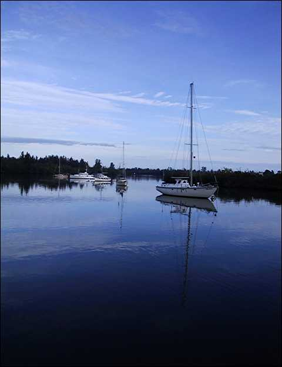
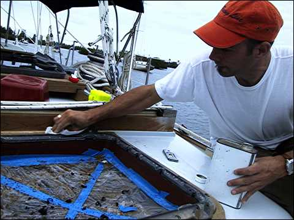
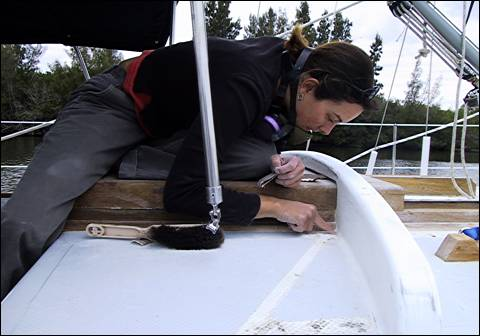
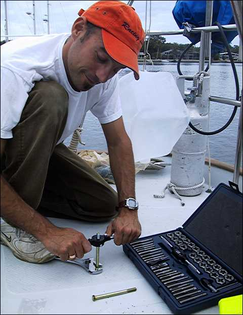
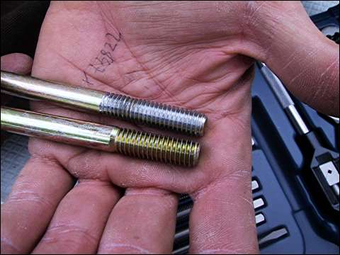

“Everything in its right place.”

So it’s New Year’s Eve here in Vero Beach, and I’ve got a bad case of the sniffles. Here’s some more pictures.

{ .polaroid }

Most mornings here are incredibly calm and the water becomes a huge looking glass. Wait, mirror. The water becomes a huge mirror.

{ .polaroid }

Here Nick is doing some final touch-up on the base of the aft hatch which we just rebedded.

{ .polaroid }

Valerie is sanding the coaming which she and Nick built earlier this year in preparation for another coat of epoxy primer.

{ .polaroid }

Nick is adding some more threads to a 5-inch bolt with his spiffy new tap and die set.

{ .polaroid }

Here’s the newly-threaded bolt compared with the original. Man, check out them new threads!

So, like I said, I’m a little ill. Nick and Valerie went over to Mandalay for a little New Year’s Eve party. I wanted to go but I’m sick so I guess it’s best that I don’t. Hopefully they will save me a piece of pie.

Happy New Year!
