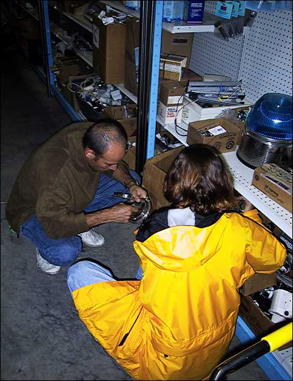
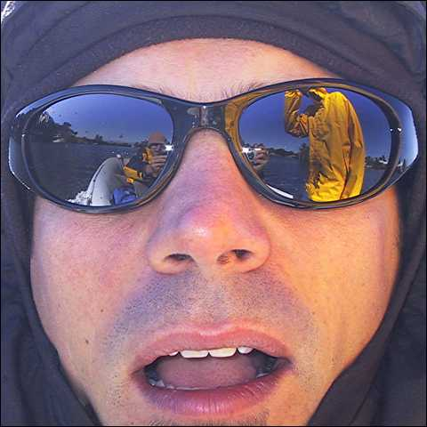
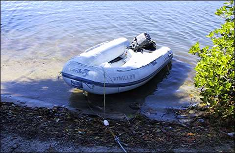
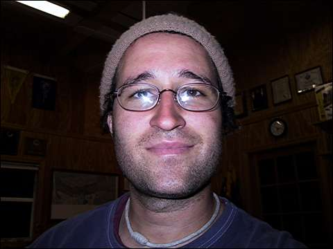

So it’s a new year already, and of course our plans have changed again. It’s a fun ride.

Now the current plan is to spend a few weeks in Fort Lauderdale working on the boat. Then we’ll head down to Key West for a bit, and from there we’ll make the 90-mile hop to Cuba, and cruise around there for a couple months or so. Then we’ll come back to Florida where Nick and Valerie will spend the summer working and I’ll probably fly down to the U.S. Virgin Islands and look for some kind of work there.

For the next few days, we’re gonna sit here in Vero Beach, finishing up some odd jobs. We’re hoping to hop outside the ICW for the passage down to Fort Lauderdale, so we’re also waiting for a good weather window before leaving here.

Last night I had my first head-rebuilding experience. (Head = Marine toilet.) The flap Valve in the bottom of the toilet bowl was a little loose and misaligned, so occasionally when pumping it out it wouldn’t seal properly and toilet water would come squirting upward in a nasty little geyser. Not fun.

Since Nick has had to rebuild both heads in the not-too-distant past, I volunteered to fix this one. So Nick showed me how to close the in and out through-hulls where seawater is pumped in to flush the bowl and waste water is pumped out. Then I disassembled the toilet and removed the flap-Valve and its housing. I took it apart and cleaned all the tasty gunk off of each part. There’s just one screw that holds the flap Valve in place, so I added a lock washer to keep the screw in place and to prevent the Valve from moving around. Finally I reassembled the whole works, opened the through hulls and gave it a few test pumps. Hooray, no more geyser. Then of course I bleached all the invisible crud off my hands.

It probably sounds real complicated, but as head repair projects go it was pretty minor, nothing compared to rebuilding the whole thing.

My next project is to build a frame for strapping the three spare diesel jerry cans to the stanchions on the aft deck. I’ll let you know how it goes.

More pictures:

Nick and Valerie rummaging through light fixtures at this huge marine surplus warehouse called Marine Connection. Check out the huge blue light special. Only $295.00!

Valerie was the victim of a toilet geyser. No, actually this is one of those mud mask type things that is good for your face. Valerie is such a hippie.

The world through Nick’s eyes.

Our little tender, parked on the beach while we went to lunch.

Hey there, Lauren. Thanks for giving me your hat. I love you. And you, too.
