“Friggin in the riggin, cuz there’s fuck all else to do.”

At long last we are no longer in Vero Beach.

Not that Vero Beach was a bad place to be, but I think we’ve all been getting antsy to move along, especially now that Cuba is on the horizon.

After finishing up some odd jobs in Vero Beach, we took on fuel and water and started heading south again. After a few hours down the Indian River, we anchored on the inside of Fort Pierce inlet and made some last minute preparations before heading out the inlet to sea, for our first overnight passage. We brought the dingy up on deck and lashed everything down, and after some lunch and a review of our course we were all set.

We headed out behind a square-rigged tallship around sunset. We each took three-hour shifts at the helm, with one person assisting the helmsman and the third free to sleep. It was a long night and none of us got much sleep. We did have a funny conversation with another tug captain, who was hauling supplies down to an Al Quaeda prison camp in Guantanamo Bay, Cuba. He said that they were getting “three hots and a cot” which was probably more than they were used to back home. He would talk for like five minutes straight and then instead of saying “over” he would say “c’mon”. I guess all tug captains say “c’mon” a lot. His colorful monologue was a welcome break from the monotony of sailing through the near-total darkness.

As the sun rose, we headed in at Fort Lauderdale and up the New River to Summerfield Boat Works. Once we got settled in we all collapsed into our bunks for a well-deserved nap.

Whoever you are, please send me something! Nick and Valerie are really nice but I’m getting really sick of them. Well no not really, but I would love more than anything to get something in the mail from my other friends. So please, a postcard, anything! Oh, the address:

Willow

c/o Summerfield Boat Works

1500 S.W 17th Street

Ft. Lauderdale, FL 33312

attn. Pascal

We’ll be tied up here for a couple weeks, doing some work on the aft deck, rebuilding our winches, finishing up the work on the coaming in front of the cockpit, and other miscellaneous stuff. Then we’ll be heading south to the Florida Keys before making the hop over to Cuba.

Here’s some more pictures from the last week or so:

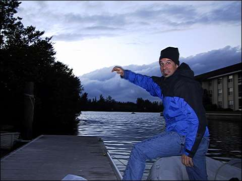

Nick hops out of the dingy in front of an ominous sky.

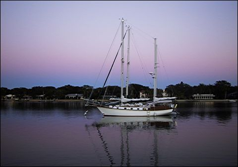

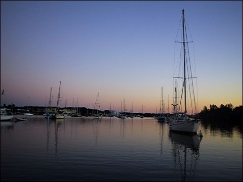

A couple of pretty sky pictures.

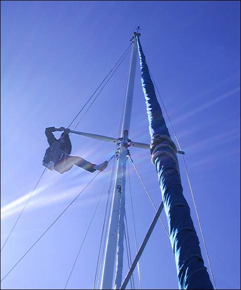

Valerie went up the mast to sew a leather chafe patch on to one of the spreaders.

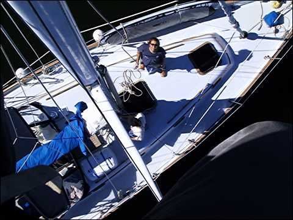

We hauled the camera up to her so she could get a few shots from up above. Scary.

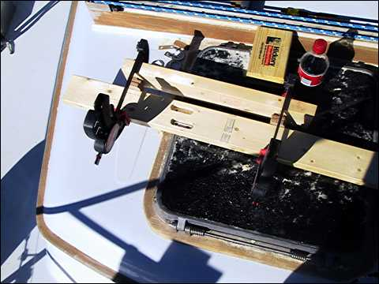

Here’s the jig I set up to route some insets into this board I was using to make a frame against which the jerry cans of spare diesel could be lashed. I also treated myself to a coke that day.

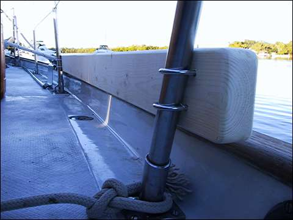

Here’s the finished product, mounted on the stanchions on the starboard aft deck.

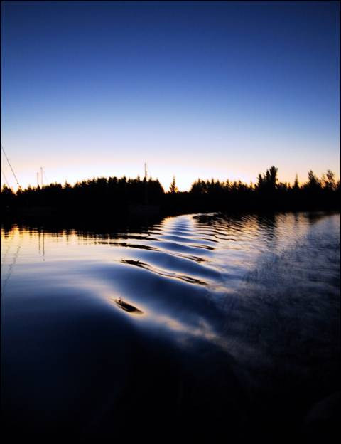

On our last night in Vero Beach, we took a dingy ride to shore at sunset and the water looked like oil. And the sky was pretty cool too.

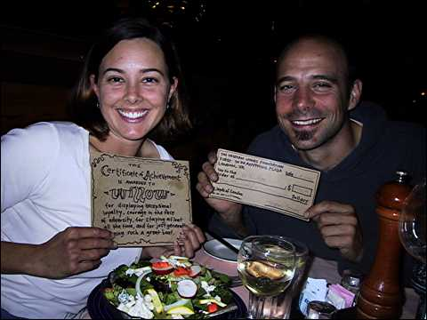

Then we went out to a fancy restaurant where Willow received a Certificate of Achievement from the Tristan Jones Foundation.

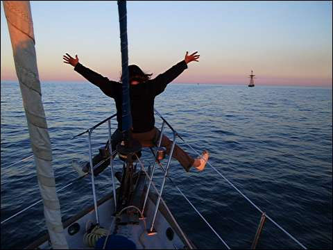

Valerie plays on the bow as we follow a tallship out to sea.

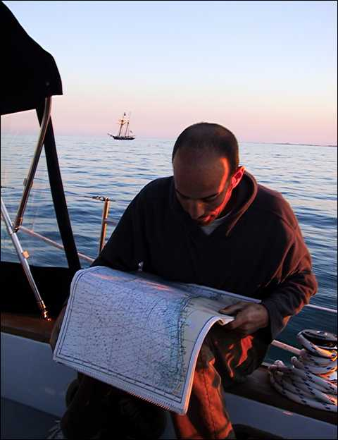

Nick looks over the charts with the tallship in the background.

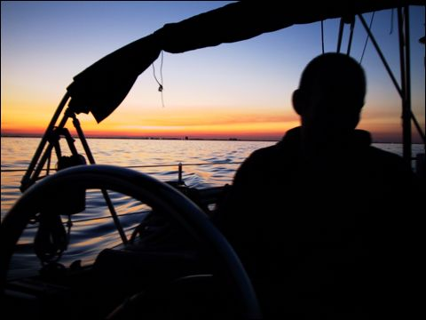

Nick silhouetted against the sunset.

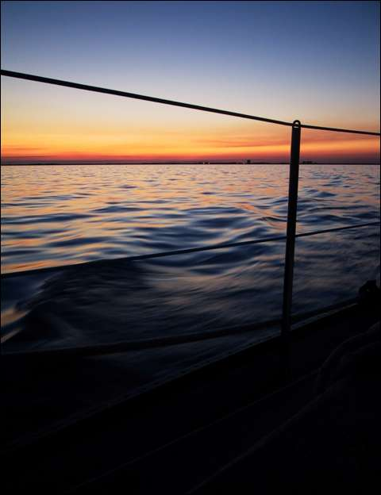

The sunset through the lifelines. Mmm mmm nummy.
