“Suddenly I’m Miss Midwest Midnight Checkout Queen until I wake up and turn back to myself.” —Hedwig

Okay, so it’s been a good while since I’ve done a diary entry. Sorry, my dear diary, I shouldn’t neglect you.

We’ve been here at Summerfield in Fort Lauderdale for over a week now, working away on various boat projects before moving on into the wild blue yonder. Here’s the story in pictures.

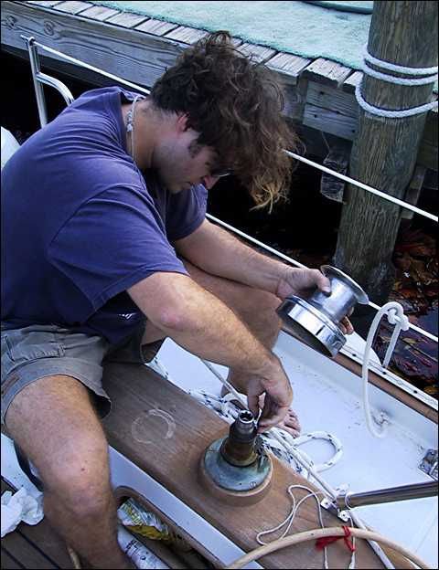{ .polaroid }

I’ve been servicing and rebuilding all the winches in the cockpit and on the mast. These are used to manage the lines which control the sails. When you’re underway, these lines can have a tremendous amount of load on them, so the winches give you a mechanical advantage when bringing the lines in to adjust the trim of the sails. In the cockpit, there are two winches for the jib sheets, two staysail winches, and a mainsheet winch. There are also a few halyard winches on the mast (for hauling the sails up or bringing them down) and a reefing winch on the boom (for reducing sail area). So I’ve been taking them apart, cleaning off all the grit and broken down grease on all the parts, using mineral spirits and a toothbrush, and then putting them back together and lubing them up with new grease. When you’re servicing winches like this it really helps to have a new wave hairstyle.

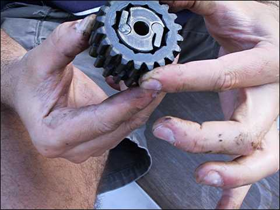{ .polaroid }

My favorite part of the winch mechanism are these little guys called pawls. They are these tiny swiveling arms, set on springs. When the gear turns in one direction, they lock in place and the gear engages, but in the other direction the gear ratchets and doesn’t impart any force. Neato. These are the mechanism by which winches do their magic, especially two speed winches. Crank the winch in one direction and one set of pawls engages, but crank it in the other direction and another set of pawls engages, rotating the drum in the same direction but at a slower speed and with a higher mechanical advantage. This is great when the sail is really loaded up with wind and you have to trim it in a little tighter. Also, the pawls sound really cool when you spin the gear around them, especially when they’ve just been cleaned and they don’t have any grease on them. They really ring out.

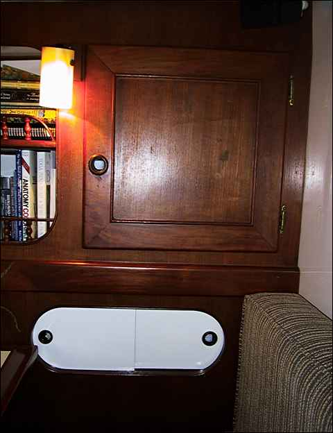{ .polaroid }

Valerie has also been doing a lot of provisioning for the big voyage since we got here. I call this cabinet the Fun Fun Nummy Cabinet. Click on it to see why.

{ .polaroid }

Here’s this guy we saw on one of our trips into town. It’s hard to tell but he’s wearing these freaky sunglasses that go over the top of your head instead of over your ears. I guess they’re good for bald guys.

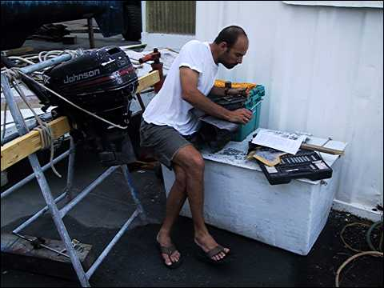{ .polaroid }

Here’s Nick studying up on how to replace the impeller on an outboard motor. This is the motor that pushes our dingy around.

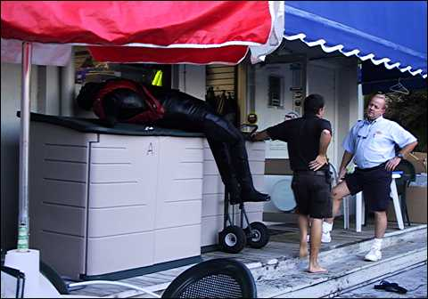{ .polaroid }

These two guys work at a local dive shop. They found this dead guy in the river and are discussing what to do with him. Alright, actually it’s just a dry suit they inflated to check for leaks.

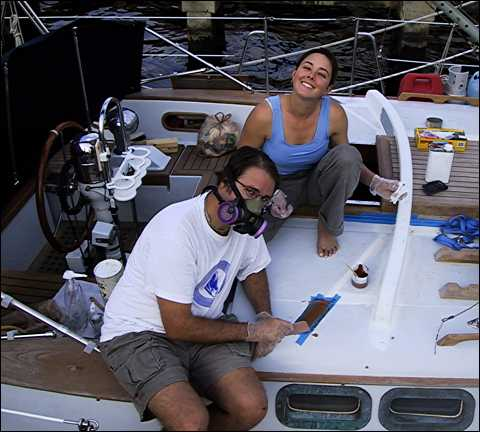{ .polaroid }

Valerie and I applied some fairing compound to part of the cabin top behind the coaming. Once it dried we sanded it smooth and soon we’ll paint it to match the rest of the cabin top. I know it doesn’t look like it, but I’m actually having almost as much fun as Valerie is.

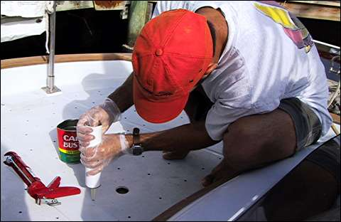{ .polaroid }

The real nasty job of stiffening up the aft deck is underway. This has been largely Nick’s project, with Val and I assisting, but he’s been doing all of the hard work and most of the worrying about whether it was going to work or not. The problem is that the core of the deck, which is basically a piece of plywood sandwiched between two pretty thick layers of fiberglass, has rotted a bit over the course of 20 years and has delaminated, so that this area of the deck feels a little soft under your feet and flexes under pressure. After much deliberating over how to tackle the problem, Nick finally decided to go the slightly less messy route of drilling a network of holes into the deck and pumping it full of epoxy resin. Here Nick has drilled 135 small holes through the first layer of fiberglass and is injecting the epoxy. Now the job is mostly done and the deck is a lot stiffer.

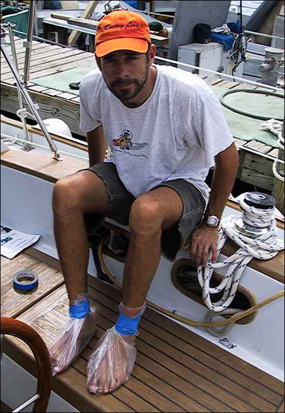{ .polaroid }

Here’s the special booties Nick got to wear during the aft deck repair. Doesn’t he look cute?

When we haven’t been working, we’ve been hanging out with other boat people.

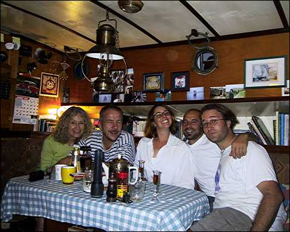{ .polaroid }

Here we are about to enjoy dinner with Michael and Alene on their boat Nin. Michael is a hardy German type who knows boats top to bottom. He drops by at least once a day to give Nick advice on how to deal with his problems, and then he comes back later to critique the execution. He used to work here at Summerfield but now he and Alene are preparing to set sail for Cuba themselves.

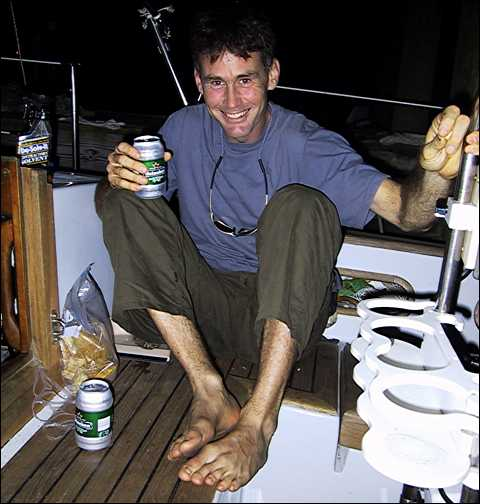{ .polaroid }

Here’s Anthony, who works on a boat that is docked nearby. He works for Julie, an eccentric 72-year-old woman who doesn’t know a thing about sailing boats but owns one nonetheless and she just hires people like Anthony to do all the sailing so she can do all the riding. They’re going to be heading through the Panama Canal and down to Tahiti this spring. Talk about Driving Miss Daisy.

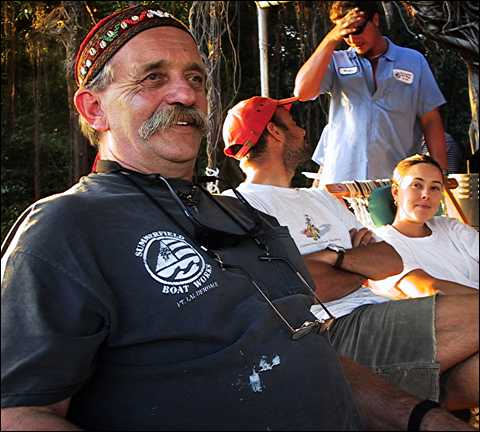{ .polaroid }

I think I may have found someone who is a bigger Macintosh nut than me, and his name is George. He looks like a visionary, doesn’t he? George shoots lots of videos on his DV camera, edits them in iMovie, burns them to DVDs with iDVD, and then shows them to his friends. He crows about how great Macs are to anyone who’ll listen. He works at Summerfield and lives at the far end of the dock, on a boat that is permanently moored alongside. His living room is on the dock itself, with a simple roof overhead. Underneath the roof is a large dining room table, with a fridge, washer and dryer, and barbecue nearby, all right there on the dock. He has a TV and a DVD player mounted on one of the pilings, in an aluminum box he built to protect them from the weather. He’s so set up, he even has DSL on the boat!

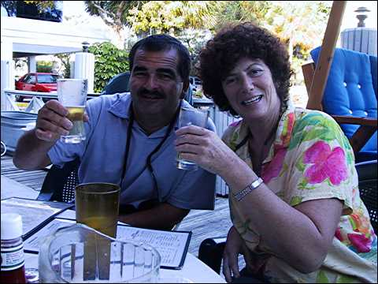{ .polaroid }

We’ve also been hanging out a lot with our good friends John and Amanda who have a boat called Gingi. They are heading to the Bahamas any day now and it looks like we’ll be following them shortly. John is an excellent musician and an accomplished sailor with tons of great advice on just about any topic you could imagine. Amanda is British and a bit of a nutter. She describes John as having three mustaches.

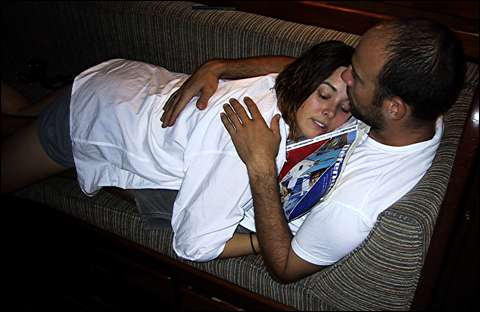{ .polaroid }

Here’s what Nick and Val look like when they aren’t working on the boat or arguing over something or fretting about money. Awww.
