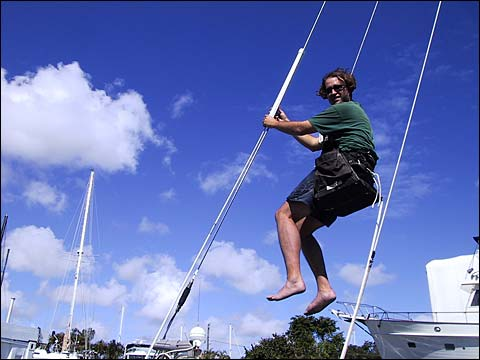
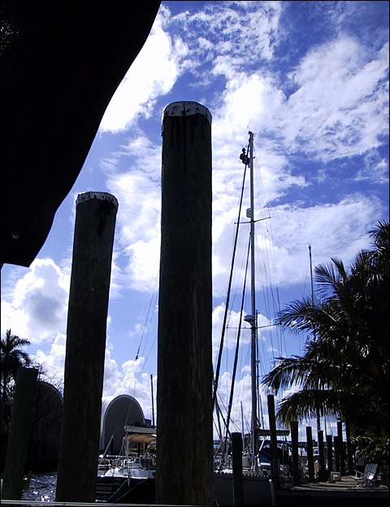
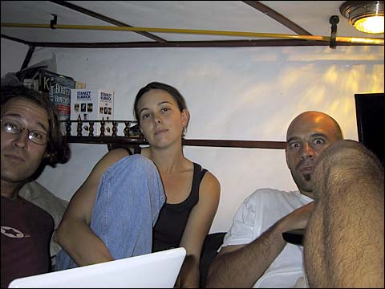
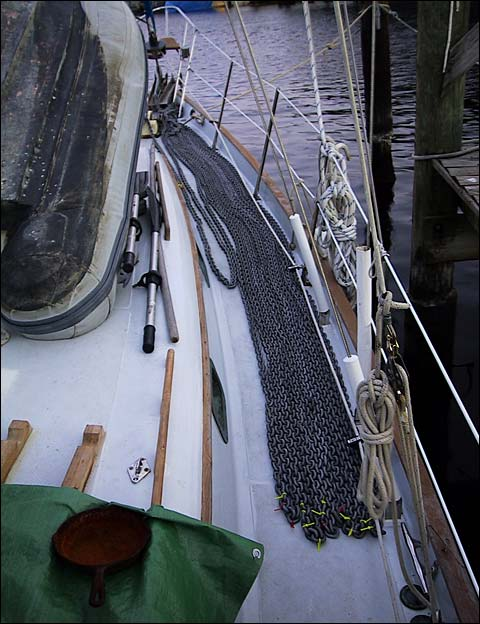
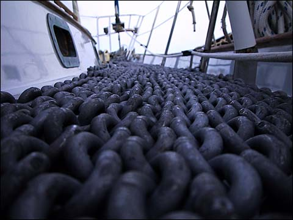
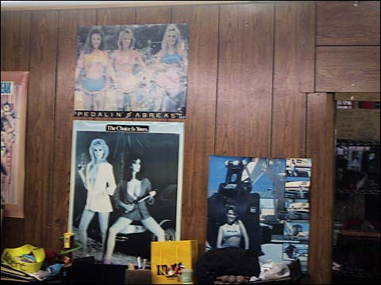
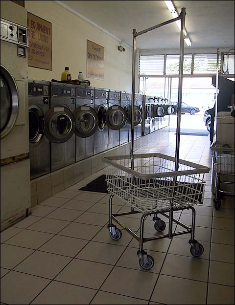
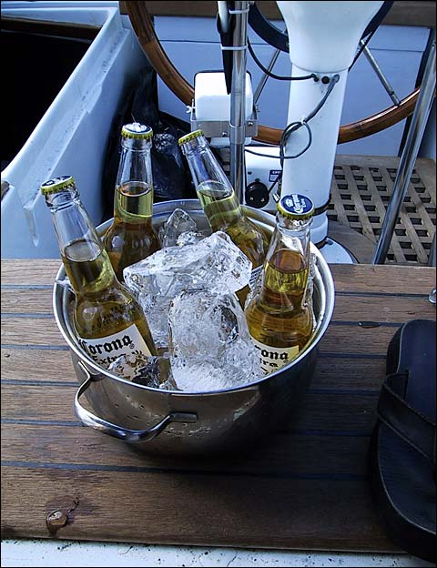

<figure>
  <figcaption>
  “If I ever feel better, remind me to spend some good time with you.” 
  —Phoenix
  </figcaption>
  <audio controls src="./Phoenix-IfIEverFeelBetter.mp3" />
</figure>

Oh my god, it’s been a long time since I did this.

Well I won’t lie to you. The month that has passed since I last wrote in my diary has not been an entirely cheery one. Nick, Valerie, and I have been working on the boat pretty much every day, trying to finish up various projects before we head out to the big blue ocean. As we’d come to a close on one project, we’d discover a whole new one that needed our attention and that must be added to the list. For a while it seemed that the work would never be done, that we would never get out of here, and pretty soon we were all very edgy and snapping at each other over otherwise minor little things. Nick and Valerie have had the added stress of having to pay for each new problem that arises while trying to maintain an intimate relationship in pretty confined quarters. And I’ve had the added stress of getting to hear them trying to maintain their intimate relationship. So it hasn’t been all that fun, at least not all the time. And you know me, I demand fun, all the time.

We’ve tried to cut the edge off the dreariness somewhat by taking days off, heading into town for movies (many movies) or by kicking back at the end of the day and watching Friends and having a beer and a good meal. Those are the moments that make the hard stuff a little easier, and now that we can finally see light at the end of the tunnel and the workload finally begins to lighten a bit, the good times are not so few and far between. So I’ve taken some pictures of some of the good moments over the past month, and left out the shitty ones. Hope you enjoy.

I finally got to go up in the rigging! Here I am up in the bosun’s chair, attaching a sleeve for the man overboard pole to the backstay. Whee!

Right next door, our friend Anthony was even higher up, having a look at his masthead. Jeeper McCreepers.

Not too long after we got to Fort Lauderdale, we made the happy discovery that there is a wireless internet service provider with an antenna (their only one in all of Fort Lauderdale) right here in the boat yard! Unfortunately there were a couple big boats and buildings between us and the antenna so reception wasn’t so great. We discovered that reception was best in the vee berth at the forward end of the boat (where I sleep), so we crowded in there for a while and surfed the web.

A week or so later, the folks in the yard asked us to move our boat to another slip, which just happened to be much nearer the antenna with no obstructions. We happily complied.

We went and bought about 300 feet of new chain for Willow. I laid it all out on the foredeck so i could mark it every 20 feet.

Here’s a chain’s-eye-view.

The place where we got the chain was this rigging and wire shop here in Fort Lauderdale. They had lots of posters and calendars with chicks on them. You know, the ones who can’t seem to find a tee shirt that doesn’t reveal the underside of their boobies. Chain chicks, I guess. They also had some nice wood paneling.

One day we went to the laundry and I saw this empty laundry basket, all lonesome.

Here’s some of them cold beers I was telling you about. Mmm, makes me wanna drop the sanding block and grab a bottle opener!
