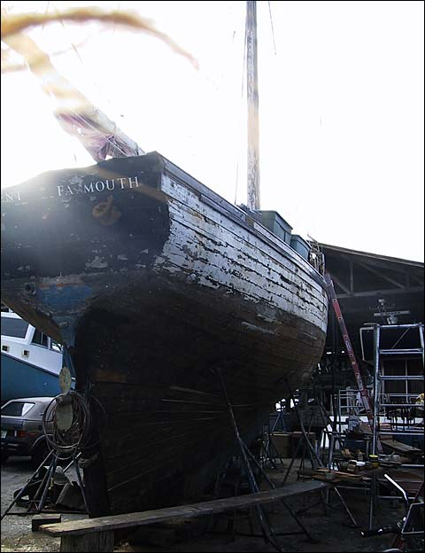
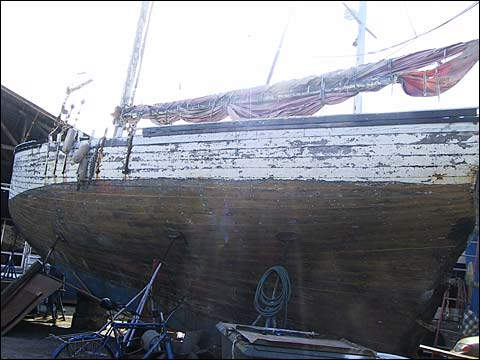
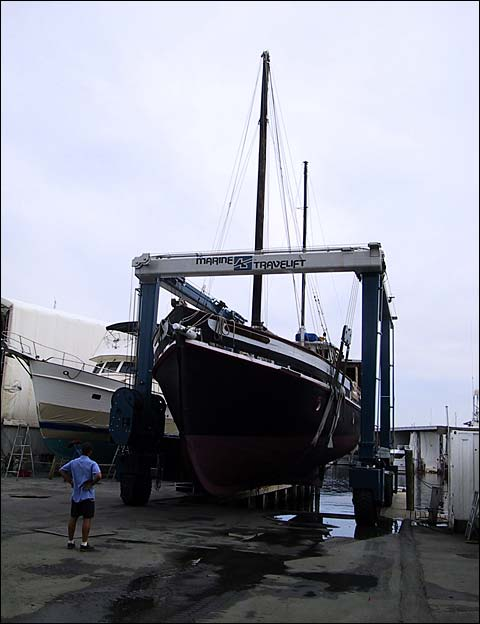
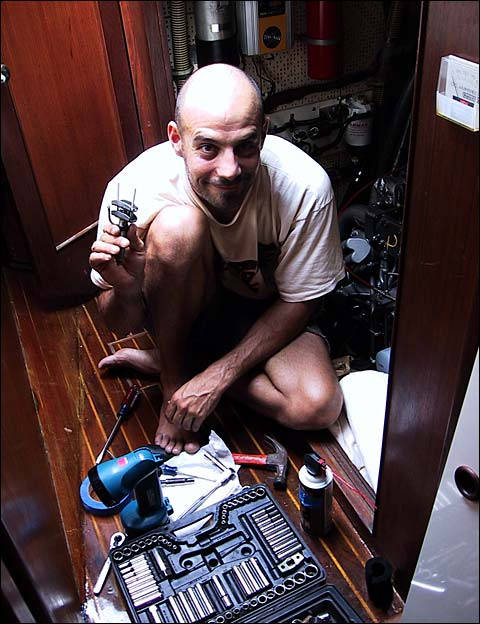
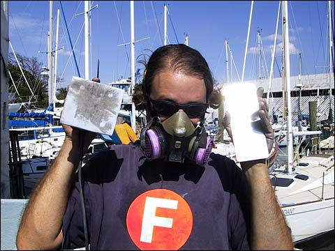
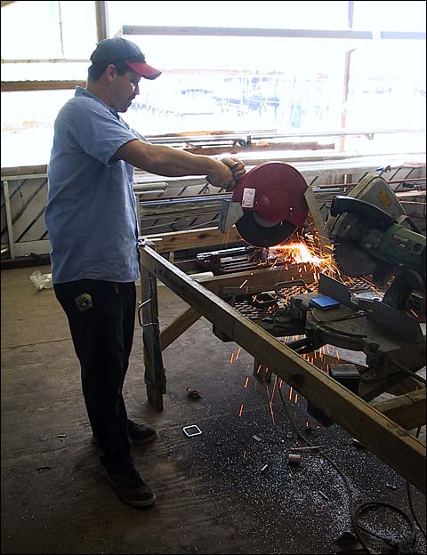
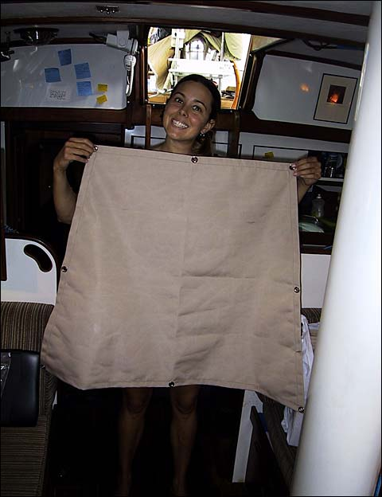
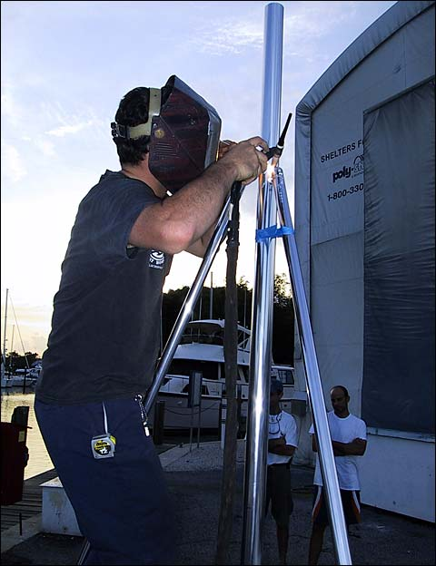
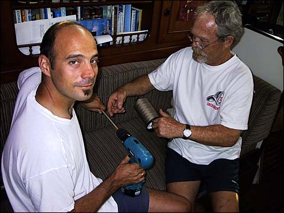

Eventually, we’d have to leave Marsha and Mario’s and return to the boat yard.

Ah, but at least we didn’t have to return to this.

This is Content, a boat from Falmouth, England that was sailed here some 20 years ago. She’s pretty much had it. Her wooden hull is rotting in many places and even where the planking is largely intact there are sizable gaps between the boards. But her owner just doesn’t seem to want to give up on her. He’s there beside her every day but Sunday, working away, sanding, milling new wood, meticulously fitting new pieces of wood into the gaps between the old. He’s launched her from Summerfield twice to check the integrity of the hull, and she sank both times. I’ve heard she sank 4 times at a different yard nearby before they finally kicked him out. But he just doesn’t give up. Never mind that the sails are in tatters, never mind that rigging is a wreck. I guess this guy is bound and determined to sail her again one day. I hope he does. But I don’t think he will.

One of the cool things at Summerfield is the 70-ton lift which they use to haul boats in and out of the water. It’s an amazing thing to see, and they have a show about every 15 minutes. Click the image above to see the boat go in the water.

After they put this boat in the water, I was amazed to see that all the dishes were laid out on the dining table on the far end of the boat, and they were completely undisturbed!

Here’s Nick in the engine room again, poor fellow. Sometimes I think he might be happier if the engine just fell out somehow. Well, maybe not.

One of our bonus projects came about as part of putting new running lights on the bow. We were taking the bow pulpit off so we could weld some new mounts for the lights, when we discovered that some of the stanchion bases at the bottom of the bow pulpit were cracked and bent. So we talked to Larry, the metals guy here at Summerfield, and he recommended building all new ones. So to save money, we decided to polish the stainless steel stock for the new bases ourselves.

There’s easier ways to do it if you’ve got the gear, but we decided to just use an electric sander and some elbow grease, slowly working the stainless up to a fine shine by using progressively finer grains of sandpaper. Here’s me in my steel-polishing getup.

Here’s Larry cutting the polished stainless into 3-inch squares for the stanchion bases.

Valerie’s bonus project was some canvas work she did for one of our neighboring boats. Here’s Val with one of the lee cloths she made. It turned out to be a much more difficult job than Nick and Valerie had expected, but it was a good learning experience and they’re even considering doing more canvas work in the future. Masochists, I swear.

Here’s Larry welding some braces onto a pole that Nick is putting on the stern of the boat. The new wind generator is gonna go up on that pole any day now.

Here’s Nick and our buddy Rich, winding some thread onto a pencil using a drill. Rich is a retired Sacramento fireman on a 28-foot Shannon. Probably the prettiest boat that size I’ve ever seen. I think if I was to get a boat, that would be the one.

But hell no, I ain’t getting no goddamn boat, are you crazy?!

1 Comment

Posted by <a href="mailto&#58;billwebbmail&#64;yahoo&#46;com">Bill Webb</a>
Thursday, April 10, 2003
 2:50 AM

Pascal, do you have a contact for the owner of Content?    Our boat, the Klang, appears quite similar from your photos.  We can be seen at www.klang2.org, check out the picture archive.  ? Bill Webb

