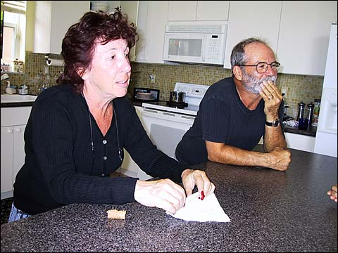
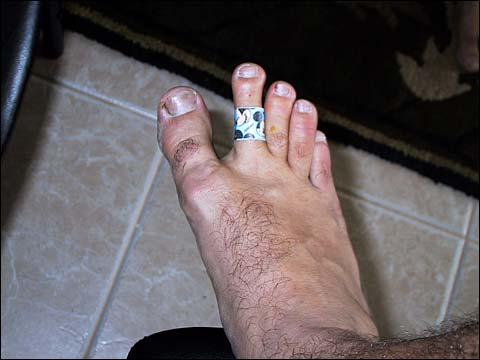
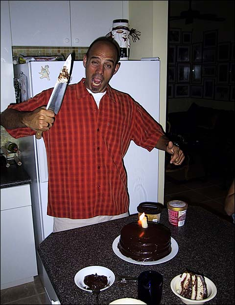
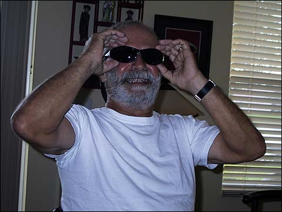
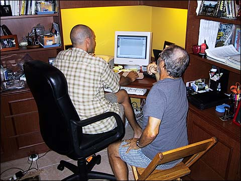
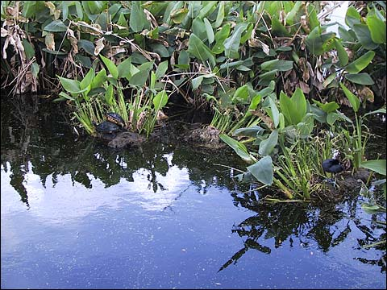
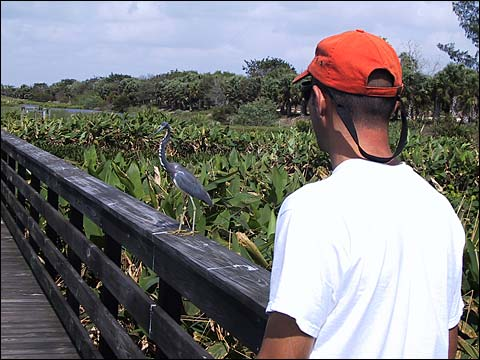
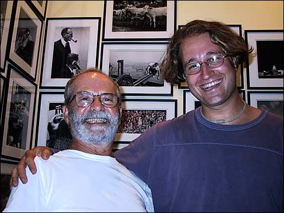
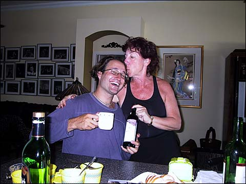

This entry is dedicated to Marsha and Mario, our beloved adopted parents.

One of best forms of stress-relief came in this wonderful little two-part package called Marsha and Mario Marino. (C’mon, three times fast.) These are the kind folks who sold Willow (nee Serenata) to Nick and Valerie, and they’ve been great friends as well. Whenever we’ve had enough of the boat yard, Marsha and Mario would come to the rescue and invite us away to their paradise villa in Delray Beach. Once away from the drudgery of sanding and painting, we’d be treated to wonderful home-cooked Italian meals and rousing games of tennis, soaks in the hot tub and rounds of mimosas. Ahh, now this is the life!

Wait, let me back up. Five minutes after we walk in the front door, I’ve knocked a scab loose and my toe is bleeding all over the kitchen tile. Marsha and Mario jump into action, Marsha’s wiping up my blood and here’s Mario with the first aid kit, and I didn’t even see him leave the room. They prop me up and Mario dresses my wound like I was his only child, and he gave me this cute Mickey Mouse band-aid, too. Right away I knew these were good people.

And yes, I can pick things up with my feet.

We went to Marsha and Mario’s for Nick’s birthday and made a nummy raspberry chocolate cake. As you can tell, Nick made short work of it.

Here’s Mario trying on Nick’s cool new shades. Sean Connery mixed with Tom Cruise mixed with Papa Smurf.

We spent a fair amount of time troubleshooting Mario’s computer, until finally we convinced him to buy a Mac. Welcome to the few and the proud, Mario!

Right near Marsha and Mario’s house is this cool wetland nature walk. Somewhere in this picture you can see a pair of turtles getting it on. Click the picture to zoom in.

Hey, at least they’re using protection! Ba-dum ching!

Here’s a few shots of Nick trying to converse with one of the local birds. Click the picture to cycle through.

Mario was the personal photographer to David Rockefeller, and he also took many pictures for Life Magazine and other publications. Here’s me and Mario in front of some of his photos. You might recognize the one of the construction worker balancing on a girder high above the city.

Marsha was delighted to find that I could keep pace with her in red wine consumption, even when she was constantly putting some kind of food in my mouth. She seemed so happy to have someone in the house who could eat so much, and I was happy to oblige.
