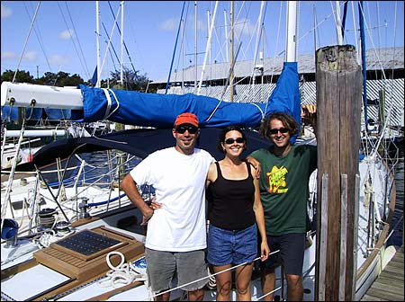
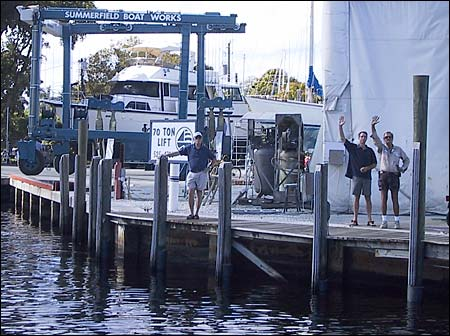
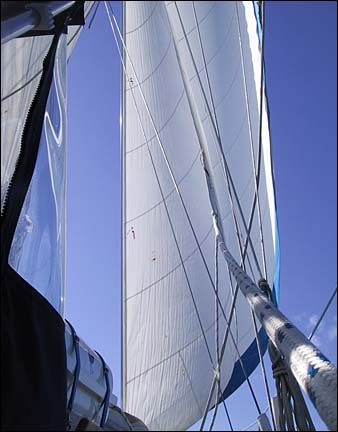
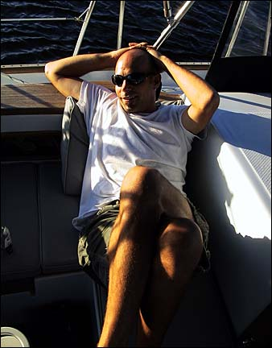
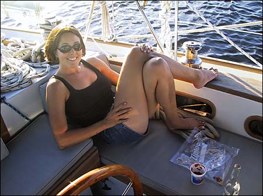
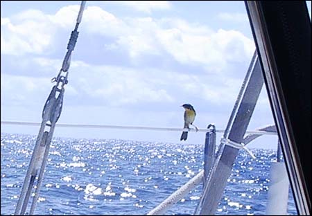
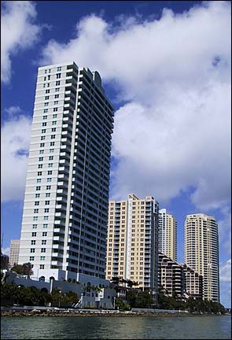

At long last we are no longer in Fort Lauderdale!

After fixing the headstay fitting, we said our goodbyes to the kind folks at Summerfield and made our way down the river. I think perhaps they were just a little glad to see us go. Certainly, we were happy to be leaving.

Here’s Willow and her crew just before leaving Summerfield.

Goodbye! (And good riddance?)

After a short trip down the New River, we anchored overnight in Lake Sylvia, and got ready for an early trip down to Miami the following day.

Once we got out of the harbor in Fort Lauderdale, we raised the sails and started south. It was good to see Willow with her canvas up again.

Here’s Nick relaxing in the cockpit as the autopilot takes us southward.

Here’s Val doing a bit of the same.

Along the way we received a brief visit from a little bird who seemed to be taking a short break.

Before long we reached Miami, and were glad of it. The people of Miami were kind enough to erect these tall buildings along the waterfront in honor of our arrival.

We’ll be here for a few days, awaiting a weather window for the Gulf Stream crossing, which hopefully will come sometime in the next week.
