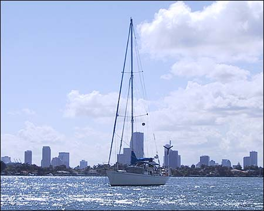
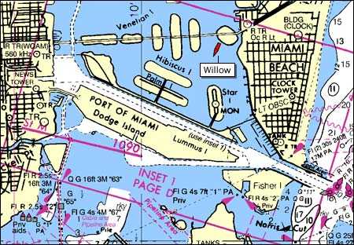
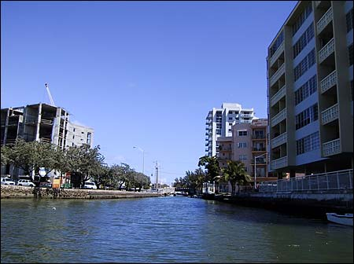
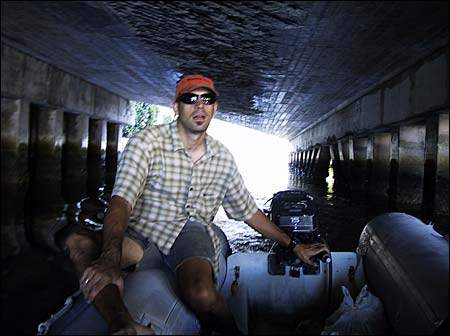
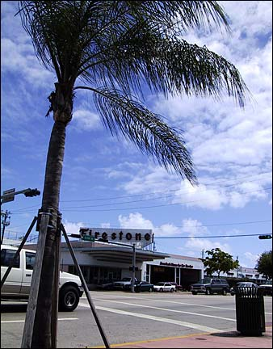
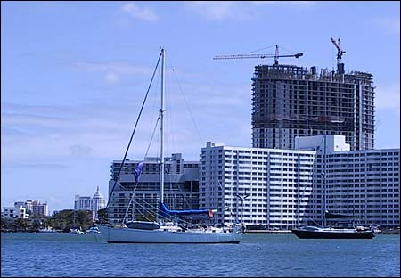

Well we’ve been in Miami for a couple days now, enjoying the sunshine and relaxing at anchor. The first night we anchored in the southern part of Biscayne Bay, just north of No Name Harbor. The following day we expected a front to be moving through, so we decided to head north a bit to find an achorage with more protection from the weather.

{ .polaroid }

After motoring around a bit, we finally settled on this spot near Belle Isle, right in the heart of Miami. It’s a bit strange being anchored here, almost like pitching a tent in the middle of the Las Vegas strip. But it’s actually pretty quiet most of the time, except for the occasional speed boat zooming by. There were quite a few of them yesterday, but they seemed to disappear with the daylight, and there haven’t been many today since it’s a weekday.

{ .polaroid }

Here’s our exact location. We’ve been tracking our position using an application called MaxSea, hooked up to our GPS (in addiition to our primary means of navigation, old-fashioned paper charts). I’ll try to post a chart of our location any time it changes significantly.

{ .polaroid }

Today, after a bit of wrangling, we got the dingy in the water and decided to head for shore. There’s this cool little canal that runs right through the heart of South Beach.

{ .polaroid }

Nick and I motored up the canal a ways, under a few bridges, and tied up near a Publix grocery store and took a stroll through town.

Looking at this next picture you’d almost think we were in the tropics!

{ .polaroid }

That is, until you see the bottom of the picture.

{ .polaroid }

I swear the folks of Miami Beach seem to have really taken a liking to us. It’s been less than 24 hours since we settled into this new anchorage, and they’re already putting up another building in our honor. Just plain kooky!
