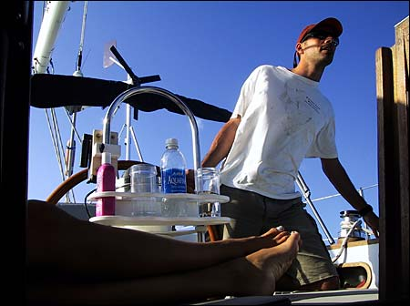
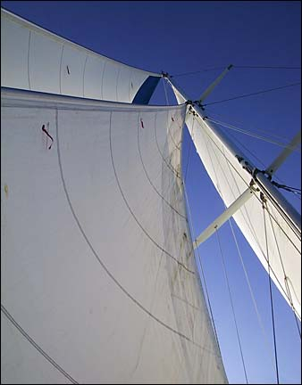
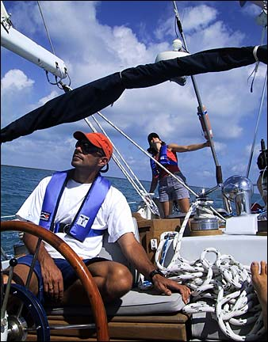
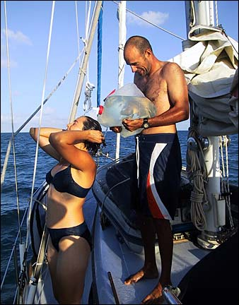
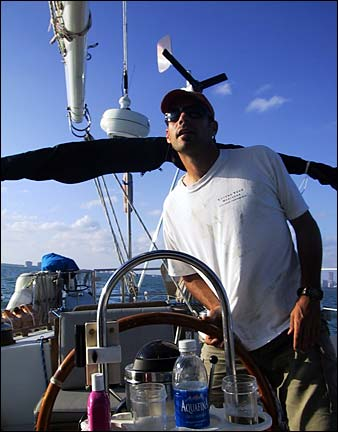
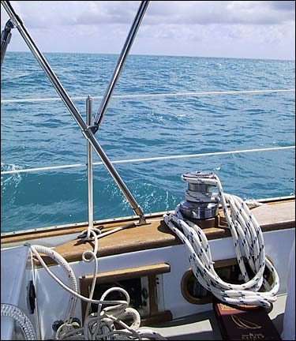
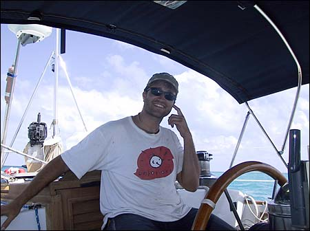
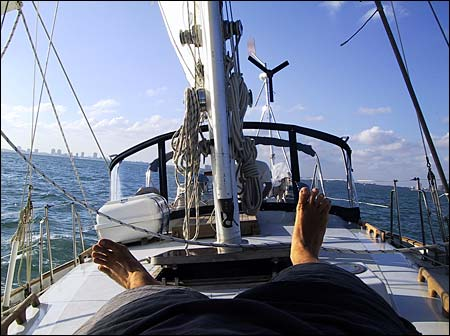
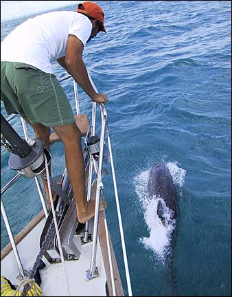

On Sunday we decided to pull up anchor and head south for the Florida Keys and get some real sailing in. We gassed up and headed south for Biscayne Bay again, where we anchored Sunday night near No Name Harbor, in preparation for an early departure Monday.

On Monday we sailed south to Key Largo, and it was a great sail. This was the first time we’ve really sailed the boat since I joined Nick and Val. We had nice strong steady winds on the beam at 15 to 20 knots and we moved along at close to 7 knots most of the day with no help from the engine. Suddenly 2 months in a hot, dusty boatyard were a distant memory.

We fetched Key Largo around 2:30 in the afternoon, and after some poking around we finally decided to anchor just south of Rodriguez Key. The bottom was very grassy, and we had a hard time getting the anchor, a 60-lb bruce (claw) we picked up in Fort Lauderdale, to set properly. I put on my mask and fins and dove on it, and dug out some of the grass under it so it could get a proper holding.

But even with the anchor set, the anchorage wasn’t very good, as it’s very exposed. Fortunately we had mild weather and only a little swell.

The next day we sailed south to Marathon, where we met our buddy Rich (the retired fireman who helped install the windbugger pole in Fort Lauderdale) who pulled into the harbor just after we set our anchor. We all dingied ashore and had two-dollar tacos, one-dollar beers, and buck-fifty showers at Sombrero Joe’s. I think that’s what it was called.

Here’s some pics from the trip down to Marathon.

Not long after I started writing this diary, it became clear that my primary function as diary-writer was to make Nick and Val look like rock stars. So here’s Nick, looking like a rock star. Just doing my job.

Pretty sails. Sails make boat go.

Even rock stars wear life vests at sea. Life vests are cool.

Once we got the anchor set near Rodriguez Key we all went for a swim and then we showered on deck. Ah, refreshing!

I think I just have to take a few more pictures like this and then I will have satisfied the requirements set forth by the Rock Star clause in my contract.

Out that way, there’s a whole lotta nothing for a long long time.

Here’s me at the helm on the way down to Marathon. Mostly I make use of my time at the helm by cleaning my ears and other orifices.

When I wasn’t at the helm, I would practice levitating up on the foredeck.

As we pulled into Marathon, we received a friendly escort from the local Coast Guard, Marine Mammal Division.

PS. Happy Birthday, Ryan!
