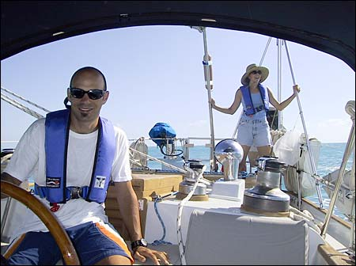
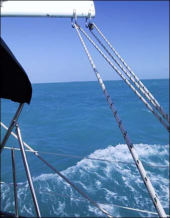
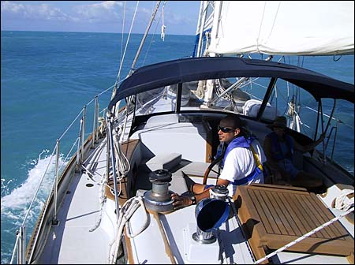
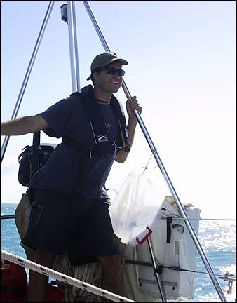
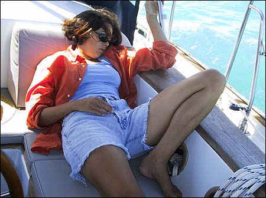
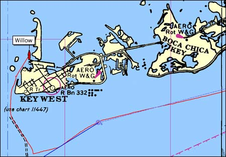
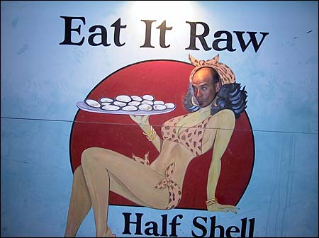

The sail from Marathon to Key West was also great, with steady winds on the beam and 6 knots of average speed. I spent much of the day at the helm, enjoying the feeling of gliding through the water, rolling slightly from side to side. I also I enjoyed the sheer megalomaniacal power of it all. But aren’t we all megalomaniacs at heart?

Here’s pictures of the sail down to Key West.

Nick at the helm and Val riding the stern.

The swell rolled under us at a leisurely pace, lifting us up and setting us down, occasionally splashing us with a bit of spray.

Here’s one of those rare moments where Nick is not watching where he’s going.

Me on the stern, riding the swell.

As the afternoon wore on, we all got a bit tired. Here’s Val passed out in the cockpit.

We reached Key West at around 3:30 in the afternoon and anchored near Fleming Island. Here’s our position. The red line shows our path into the harbor.

Once we tidied up the boat a bit, we had another quick shower on deck and hailed the water taxi to take us ashore for dinner. It’s Spring Break here in Key West, so the mood on shore was festive and light and collegiate. Nick quickly showed he could party with the best of em.

My cousin Chuck (locally known as Chas) lives here so I’m finally getting to hang out with him on his turf. We’ll be here for a few days, enjoying all that Key West has to offer. More later…

5 Comments

<!-- 

Posted by <a href="http://www.pascal.com/cgi-bin/mt/mt-comments.cgi?__mode=red&id=452">Phil Sidney</a>
Saturday, March 23, 2002
10:12 AM

Pascal,     03-23-02  You have a great site.  I was looking up Pascal Compilers and decided to try WWW.Pascal.com and fumbled across your site.  It is freezing in New England with 4” of snow on the ground and wind chill of about 18 degrees.  So I really enjoyed your Florida photographs.   I went to the University of South Florida in Tampa and my roomate and I sailed from Saint Augustine to Miami several times in college.  Your photographs are great.  What system are you using?  If you are to busy to respond I understand.  Happy sailing!  Best regards, Phil Sidney Shirley, Massachusetts (50 Min. NW of Boston) users.rcn.com/philsidney/

Posted by <a href="mailto&#58;pmajon&#64;yahoo&#46;com">Pascal Majon</a>
Saturday, April 27, 2002
 3:15 AM

Pascal,  What camera did you use to take these photos?  Thanks,  Pascal

Posted by <a href="mailto&#58;richmc28&#64;hotmail&#46;com">Rich  McCrackekn</a>
Saturday, May  4, 2002
 5:16 AM

Hey Pascal,  Great photos, good to hear how things are going.  I’ll stay in touch, because I may see you in the Bahamas.  I’m In Calif now, but intend to return to Fl.this month.  I to plan a short trip to the Bahamas befor i put the boat away for the summer.

Posted by <a href="http://www.pascal.com/cgi-bin/mt/mt-comments.cgi?__mode=red&id=455">Pascal</a>
Thursday, May  9, 2002
12:22 PM

My name is pascal, my nickname is Manuela. I’m stravestiet.I want to have menny picetures from jou. And I want to meat jou. Wen: 22 Mei How late: 9 o’clock Pleace: Key West  greatz your won and only Pascal.

Posted by amr sami
Monday, November 25, 2002
 8:59 AM

lol nice pix, and thans for your song (You’ll Pick My Name)
 -->
