At long last, here’s some of the photos I’ve taken since departing Willow.

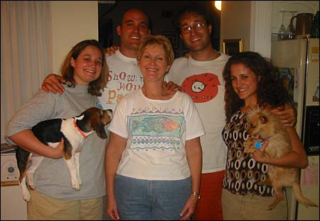{ .polaroid }
Here’s my family, Erin, Ryan, Me, Lauren, and me dear mammy, as well as Erin’s dog Charlie and Mom’s dog Prancer.

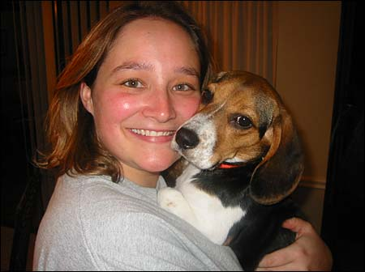{ .polaroid }
Erin and Charlie. Charlie is a girl. So is Erin.

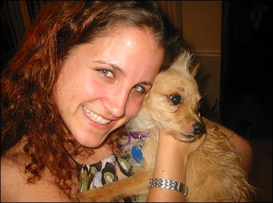{ .polaroid }
Lauren and Prancer. Prancer is a boy. So is Lauren. No wait, she’s a girl.

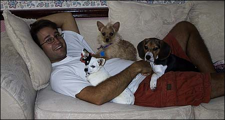{ .polaroid }
Me and Charlie and Prancer and Peedee. Peedee is my brother’s dog. Peedee is a girl.

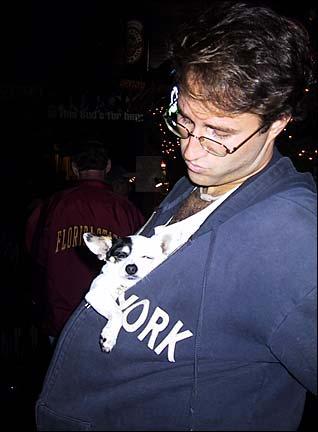{ .polaroid }
Me and Peedee went out on the town, but she didn’t last long. A few drinks and she passed out in my sweatshirt.

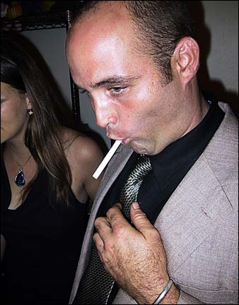{ .polaroid }
The following weekend I went to New Orleans with my nutty brother Ryan…

{ .polaroid }
…and his nutty girlfriend Sarah…

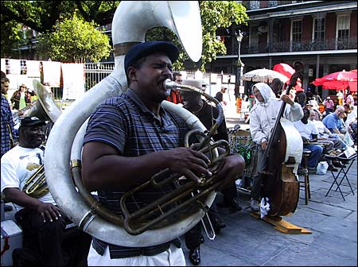{ .polaroid }
We roamed around during the French Quarter Festival and listened to some awesome music. This is Doreen’s Jazz Band on Jackson Square…

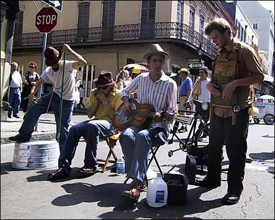{ .polaroid }
…and this is the Kitchen Syncopators on one of the side streets in the quarter.

Have a listen:

<figure>
  <figcaption>Do What Ory Say by Doreen’s Jazz Band</figcaption>
  <audio controls src="./doreensjazzband-dowhatorysay.mp3" />
</figure>

<figure>
  <figcaption>Johnson City by The Kitchen Syncopators</figcaption>
  <audio controls src="./kitchensyncopators-johnsoncity.mp3" />
</figure>

Later that night we hit the town and knocked a few back.

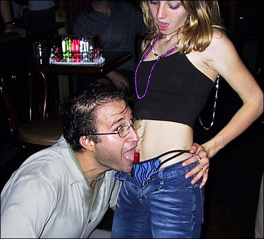{ .polaroid }
My brother was kind enough to buy me a drink, but he was also mean enough to stick it in this girl’s pants.

The rest of my trip to New Orleans is a bit of a blur and for some reason there aren’t any pictures.

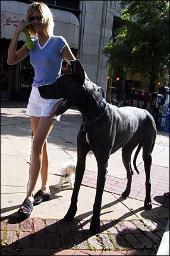{ .polaroid }
About a week later I went to Birmingham to visit some friends for a while. I saw this woman whose pet dog was so big that it had a pet dog of its own.

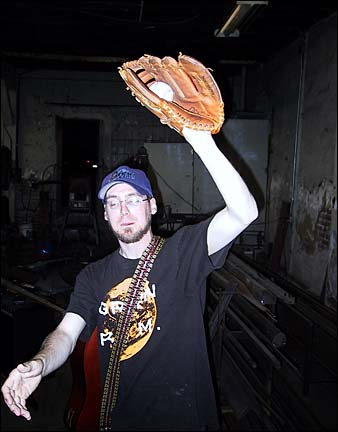{ .polaroid }
I went to a friend’s blacksmith shop and played catch with my friend Peter.

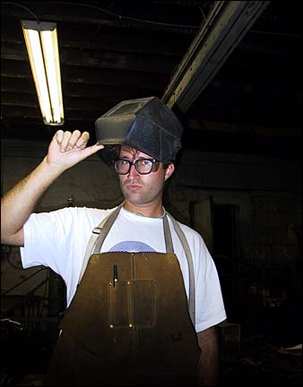{ .polaroid }
Then I tried on some of the gear lying around.

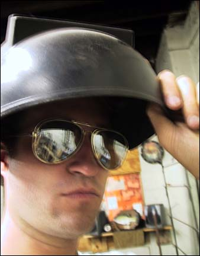{ .polaroid }
Bad fuckin ass.

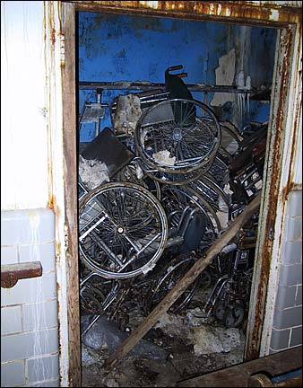{ .polaroid }
A few days later we went to this creepy abandoned nursing home that my friends discovered. This is a closet full of old wheelchairs.

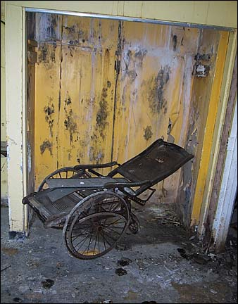{ .polaroid }
This is the first wheelchair ever built, I think.

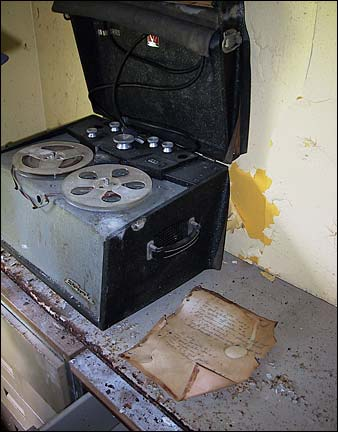{ .polaroid }
There was an old reel-to-reel player with handwritten instructions.

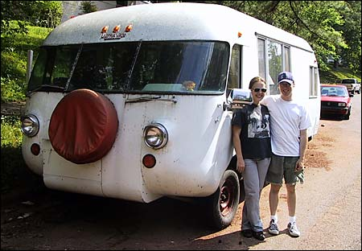{ .polaroid }
This is Peter and his girlfriend Mary standing next to an Ultravan that’s parked in their neighborhood. Later I met the guy who owns it, I guess there were only like 450 ever made and only 50 currently running. He and his wife traveled the states for 3 years in this one.

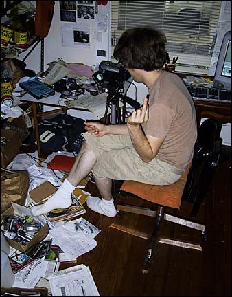{ .polaroid }
Here’s my friend Paul working on one of many video projects. He’s an iMovie maestro.

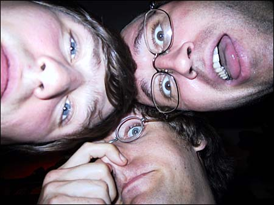{ .polaroid }
Later me and Paul and his boyfriend Paul went out for Indian food. Mmm nummy.

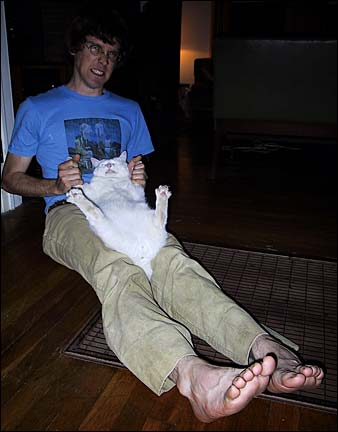{ .polaroid }
This is Paul playing with his cat Monk. Sometimes they play rough.

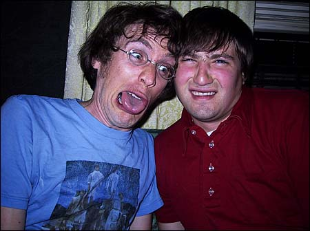{ .polaroid }
Then we made some scary faces. Click the picture to see more scaries. Note I gave myself another dang haircut.

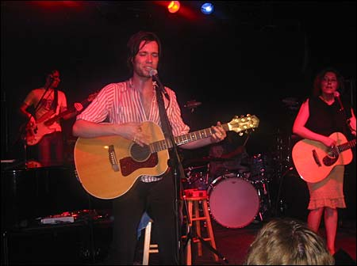{ .polaroid }
Finally, Lauren and I went to Birmingham to see Rufus Wainwright in concert. He was awesome.

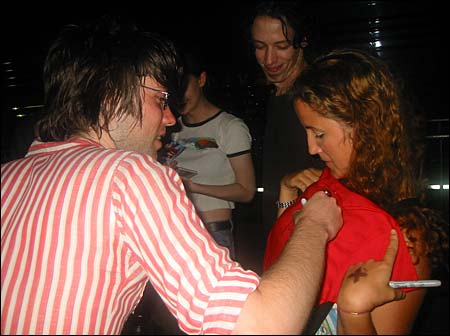{ .polaroid }
After the show, we waited by the bus like good little groupies and Rufus signed my sister’s chest.

Aight, that’s all for now. Here, listen to some Rufus.

<figure>
  <figcaption>Grey Gardens by Rufus Wainwright</figcaption>
  <audio controls src="./rufuswainwright-greygardens.mp3" />
</figure>
