
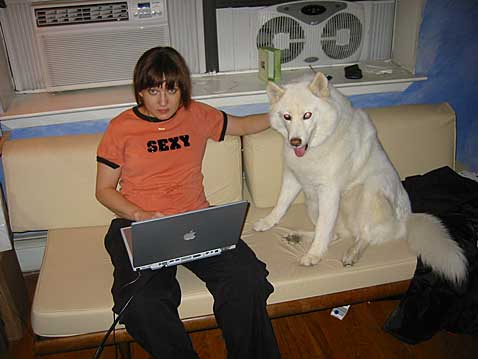

Rachel and her doggie Raba.

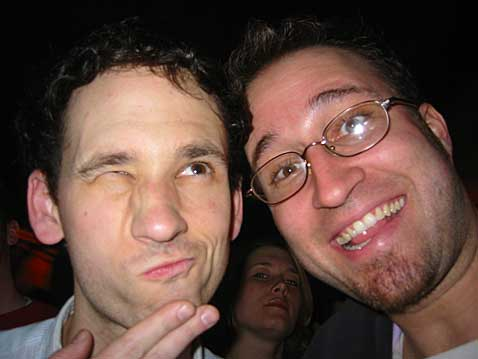

Me and Bobby (from The Love of Everything) at the Mercury Lounge. I saw him play, then the Prosaics and then Joan of Arc. Check out that girl lookin all bad-ass behind us.

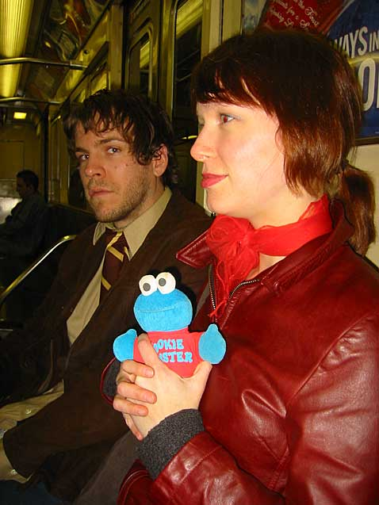

Kyle and Caithlin. And Cookie.

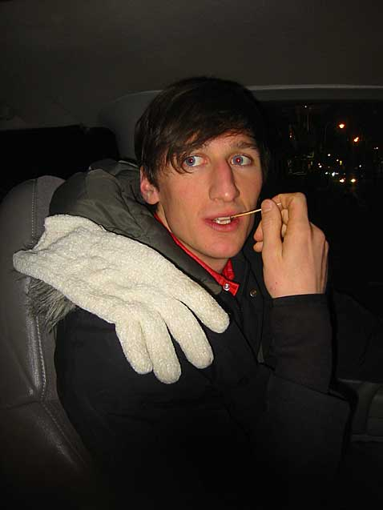

Jason (from Mates of State) and the Hamburger Helper’s larger, scarier cousin.

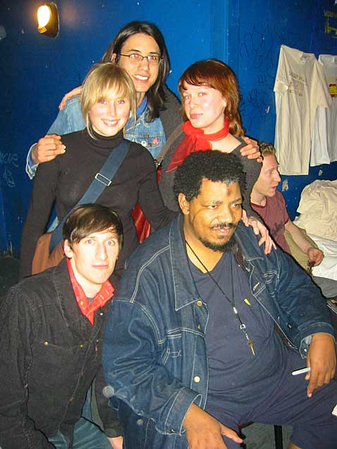

A shot with Wesley Willis after the show. I think he’s lookin at some girl’s ass.

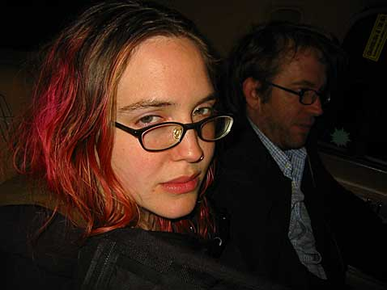

My friends Kari and Pete in a car goin to Brooklyn. After I took this picture, Kari’s eyes hopped out and strangled me to death.

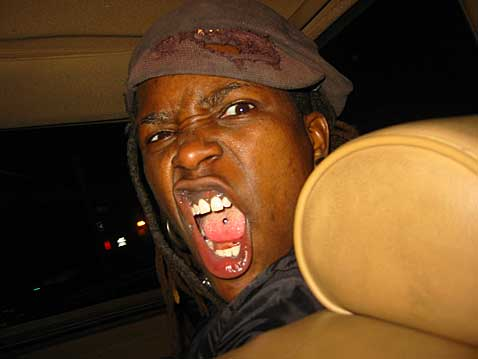

Crazy Shannon rode in the front seat.

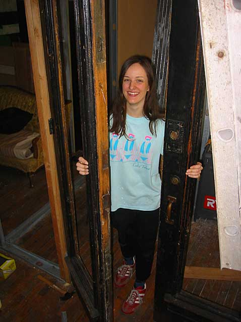

The next morning I woke up on a couch at Pete and Kari’s and built a closet with two total strangers. Actually they are Pete and Kari’s roommates. This is one of them, Anna. It’s her closet. Insert coming-out-of-the-closet joke here. Pat self on back for being so clever.

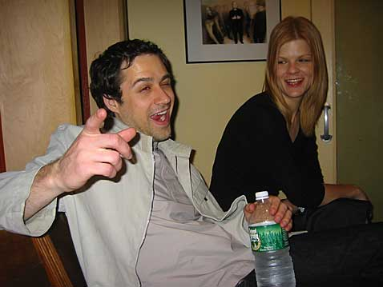

Kevin and Eileen hanging out at Dubway, the studio where Kyle recorded his new record. Kevin is laughing at your coming-out-of-the-closet joke. Mock-laughing, that is.

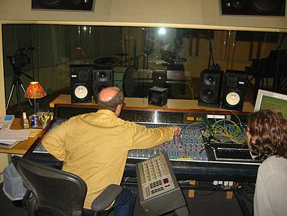

Mark Haines working the board at Dubway. You can sorta see Kyle through the glass.

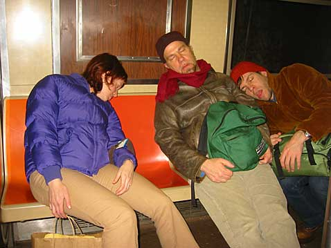

Everyone seemed to be sleeping on the F train after we left the studio, so we did the same.

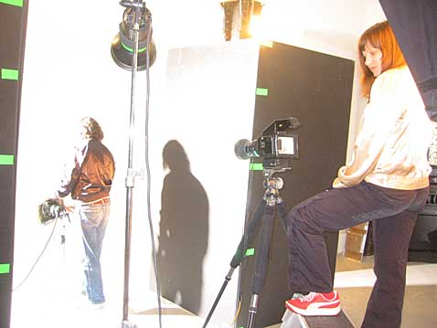

Here’s Rachel and B at work. They are getting ready to take a picture of Superman for an Adobe ad.

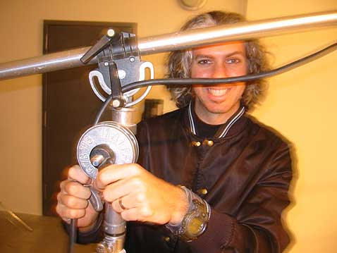

This is the last thing I saw before I left New York. No, that’s not a moustache.

