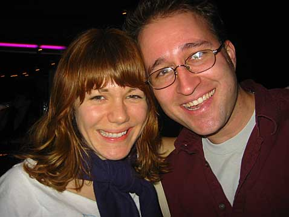
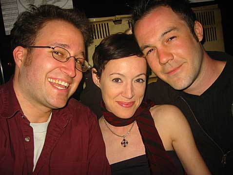
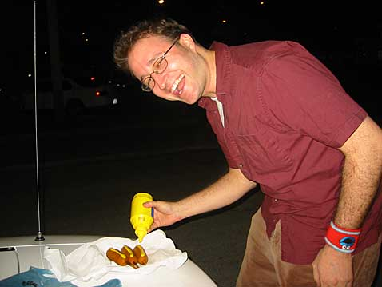
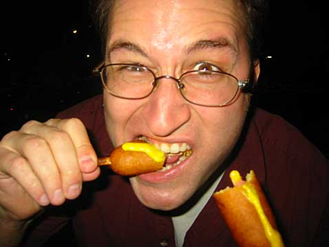
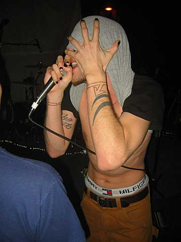
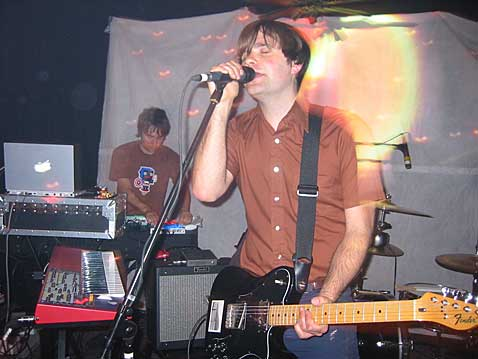
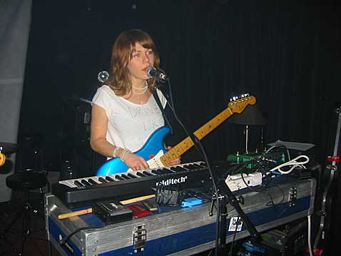

On my way to Madison to meet up with the rest of the Hellriders, I decided to stop in Nashville to catch a show that I just found out was happening on Friday night at the Slow Bar. A band that I’ve like for a while, the Mountain Goats, was playing, and I’ve never got to see them live before. Actually the Mountain Goats are pretty much just one guy who sings and writes all the songs, although he seems to be working pretty steadily with this other guy plays bass and sings backup. The show was being headlined by the Postal Service, a new band that is the side project of a guy from Death Cab For Cutie, whom I also like, and some guy from band called Dentl that I’ve never heard of. Opening the show was Cex, never heard of.

I got there early, before the bar was even open, and went around back to find Nick from Death Cab and John the main Mountain Goat waiting for Mike Grimes, the owner, to show up so they could load in. Talking to John was interesting because I’ve got two of his albums and heard his voice many times over, but I never would have imagined that voice coming out of this tall, lanky, clean-cut frame. He was super nice and told me some stories about touring Sweden and Europe. Then I bought his new album, which was put out by 4AD with some standard Vaughan Oliver eye candy packaging, and I told him I was about to start a tour myself and gave him a copy of my record. Then we started reminiscing about old video games which we’ve both played using MacMAME. Dork Talk.

I hung out in the bar and read Michael Moore’s new book while the bands set up and did their sound check. Then I noticed that one of the people in Postal Service was Jenny, who’s the lead singer from Rilo Kiley, whom I saw open for Rainer Maria in Orlando and Tallahasse last year. Me and Lauren hung out with Jenny and the rest of the band after that show and had a grand old time. (The next time Rilo Kiley played Florida Lauren got up on stage and sang with Jenny.) So I reintroduced myself and gave her a copy of my record, too.

…

I’m sitting in Kinko’s right now writing this and there’s a guy next to me on his PC laptop and he has the most annoying nose whistle in the fucking world. I’m gonna go pinch his nose and slap the crap out of him.

…

Okay he beat me to a pulp but I’m all better now.

Before the show started my friend Emily and her boyfriend Anthony showed up with three corn dogs for me. We went out to their car and I made short work of them. I once held the Adjacency title for most corn dogs consumed in a sitting, although I didn’t hold it long. The title, I mean.

They were chicken corn dogs, actually, so I didn’t feel too ill.

Then the show started and Cex came out with his blueberry iBook and his eyes duct taped over. He was really awesome. Emo rap, I’d call it. Real good stuff.

Then the Mountain Goats played and that was real good too. Not mind-blowing, but it was good.

Then Postal Service played and they were really good. The Dentl guy was running a powerbook cranking out beats and all kinds of other noise, and the Death Cab guy played guitar and sang and played keyboards and sometimes he played drums along with the beats and those parts were extra kickin. Jenny sang and played keyboards and guitar.

The night was really great for me because I had been feeling really socially inept for like 2 or 3 months prior. But that night I had lots of silly and serious conversations with total strangers and even flirted at length with a couple of girls, which is no small feat for me. I also shmoozed with a couple of DJs from Vanderbilt’s college radio station, and I might get the chance to do an on-air thing there to promote the show in Nashville later this month.

After the show I was super-pumped and happy with life and myself. It was 1:30, so I hopped in the truck and drove until 4 am, listening to music and thinking over things I wanna do on my next album and in my live shows. Then I got tired and pulled over in a Drury Inn parking lot and went to sleep on the futon I had put in the back of my truck. I happened to have my compass with me so like a dork I parked with the rear of the truck facing east so the sun would wake me in the morning. I wanted to get to Madison in time to have dinner with my friend Anne (Emily Lundin’s mom) and I wasn’t sure how much more driving I had to do. I woke up at 8:30 and I was in Madison by 2:30. So of couse I went to Vientiane with my friend Ed. Nummers. 32A: Curry Squash, two stars, tofu.

1 Comment

<!-- 

Posted by e fro
Thursday, April 24, 2003
11:06 AM

Man, 29 A  (curry dishes) with two stars and tofu all the way!  mmm…love curry.  just watch out for the string of rotten potatoes at Vientiane.
 -->
