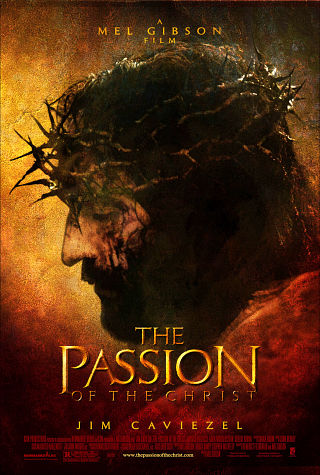

Tonight I went to see the Passion of the Christ by myself.

(Opinion follows. Quit reading now.)

Meh.

I think anyone who sees this movie will read their own world view into it. For me, I kept thinking of all the people throughout history who were similarly punished and crucified (or put to death in some horrible manner) for having unpopular or heretical views, but who didn’t also happen to be the Son of God, or at least think they were.

I also kept reminding myself that it was a movie, that the pieces of flesh being torn from his body were some sort of elastic polymer soaked in red syrup, that the cross he was lugging around was almost certainly hollow or at least made of some lightweight wood-resembing material, that the harnesses holding him to the cross as he died were in fact very well hidden and probably also quite comfortable. Son of God or not, the real Jesus certainly had it much harder.

Even so, I found myself wincing a lot.

As it dragged quite literally on, I began to pick it apart even more, cynic that I am. I thought it was funny how the movie conveniently slowed down during all the parts that portrayed the most famous of bible moments: Judas’ betraying kiss, Peter’s trio of denials, the freeing of Barabbas, others.

Some parts were quite laughable. A woman tries to help Jesus as he is struggling to carry his cross up Calvary Hill, wiping his face with a cloth. She comes away with a perfect image of the face of Christ, rendered in blood. Yeah, uh-huh, and I’m Forrest Gump. As Jesus is being prepared for crucifixion, we’re shown a flashback of the last supper. Someone wraps several loaves of bread in a cloth and hands it to Jesus, who then throws open the cloth, revealing the bread. Then it flashes forward to the Roman soldiers, stripping Jesus of his clothing, again revealing “the bread”. I’m sure Mel thought he was being real clever with that juxtaposition. And then when Jesus dies, an earthquake simultaneously strikes, creating chaos and confusion and splitting the temple right in two. This God is a mighty God, indeed. In the hubbub that ensues, a soldier is ordered to make sure that Jesus is dead and given a spear to thrust into his side. As he does so, a torrent of Jesus’ blood rains down on him. The soldier falls to his knees, as if the gush of blood on his face somehow helped him to see the light. Myself, I would have been like, “Ew, gross” and stepped aside. But what do I know.

Finally, the movie ends showing Jesus’ garments laid out in his tomb, empty, and then Jesus himself, clean and unbloodied, resurrected, looking into the light coming in from the opening of the tomb. He rises and walks toward the light, and we see he still has the holes in his hands from the crucifixion. I would have kept those, too, if I were Jesus. Those holes are badass.
