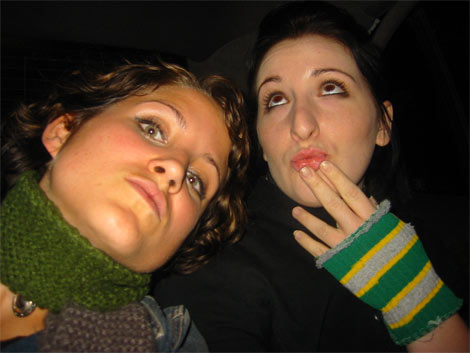
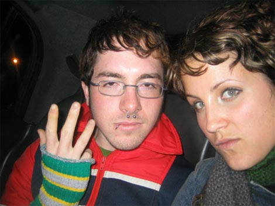
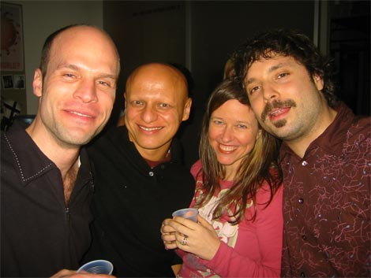

My sister Lauren got to town last nite. I guess now she calls herself Bama. She goes to school in Florida. She came with her two friends Matt, who now calls himself Levi, and Liz, who now calls herself Liz.

We went to a party at the <a href="http://www.zagodesign.com">Zago</a> office, my friends’ design firm. Here’s some pics.

Lauren and Liz.

Me and Lauren.

Levi and Lauren.

Levi has three fingers. At least.

Lucio and Kevin.

Lauren and Eileen, Kevin’s girlfriend.

Someone and Mauro and Someone and Manuel.

Several pics of me and the bird. Click it.

2 Comments

Posted by sara
Thursday, March 18, 2004
 6:55 PM

lauren says “hi, my name is lauren and i make the same facial expression for every photo i’m in EVER.”

Posted by <a href="mailto&#58;sabbat22&#64;yahoo&#46;com">Michael</a>
Friday, April 16, 2004
 1:42 PM

Lauren is cute. And pretty. And attractive. And has nice eyes. Grey eyes. Mmmm. And good skin, too.

