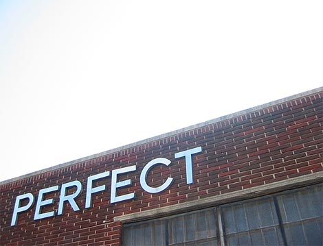
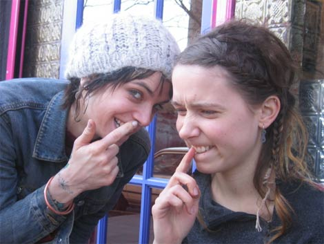
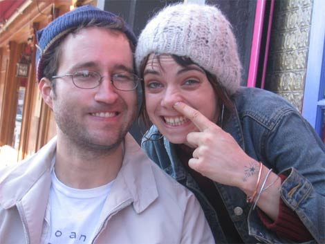
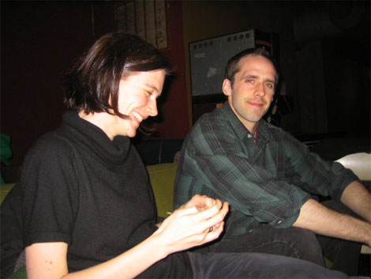
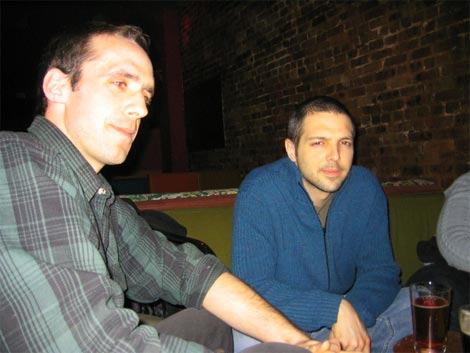
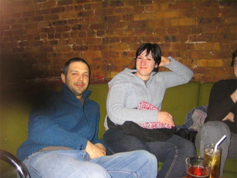
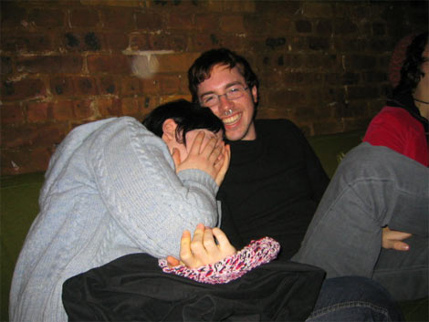
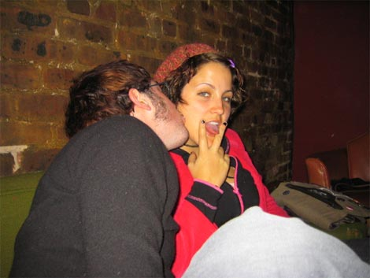
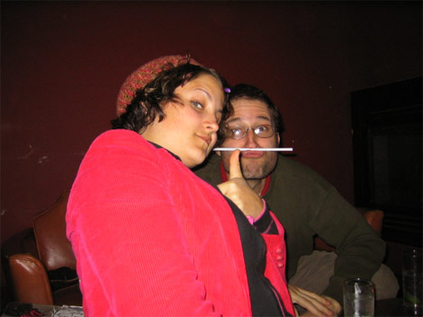
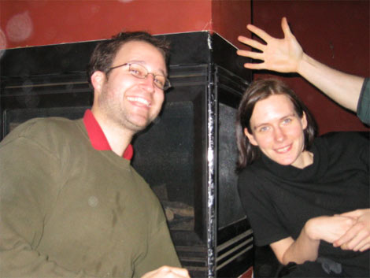

Today we were pretty lazy, having come home pretty late and pretty drunk the night before. We slept in.

After a while we all came around and decided to walk to a nearby mexican cafe to meet Charlie and Arone for lunch.

It was a nice day. I wouldn’t call it a perfect day, but it was nice.

{ .polaroid }
I guess someone else thought otherwise, cuz they put up this sign on one of the buildings along the way. Too bad they fucked it up a little.

{ .polaroid }
We weren’t at the cafe long before Arone and Charlie started making weird faces.

{ .polaroid }
It might have been something in the food, cuz it started happening to me too.

Then we went to Beacon’s Closet where I soon remembered what little interest I have in shopping for clothes. One nice thing though: this woman asked me about my shirt, she said, “Is that a homemade Joan Jett tee shirt?” and I said, “Yep, it sure is” and she said “That’s awesome, rock on!”

That felt good. I like when people tell me to rock on. It’s a reminder that I’m already rocking, and I merely need to continue doing so.

Later that night we went to Zaytoon’s for dinner, and on the way home we bumped into some neighborhood friends who convinced us to go to the Boat with them for drinks. Once there I insisted on playing that annoying game where everyone takes a picture of the two people to their left.

{ .polaroid }
Nikola and Doug.

{ .polaroid }
Doug and Josh.

{ .polaroid }
Josh and Liz.

{ .polaroid }
Liz and Levi.

{ .polaroid }
Levi and Lauren.

{ .polaroid }
Lauren and Me.

{ .polaroid }
Me and Nikola.

I guess it’s not really a game, is it? Well, whatever, we played it. And everybody won. The End.
