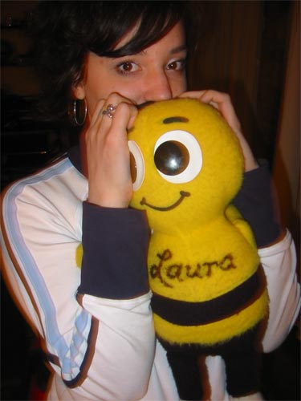

Last night we played at Nevin’s Live in Evanston, in North Chicago. My friend Laura&nbsp;B took 13 trains and two buses to come see the show, which was real nice of her. So I got her a present.

Aw.

I also got a surprise visit from Julia Jay who put up the Hellriders in her apartment on last year’s tour.

The show went really well, the sound was good (thanks to Pete) and the execution went much better than the night before. Stephanie stepped in and played keyboards on Mud and Darren is playing drums for almost every song, which helps a lot I think.

My pants fell down for some reason during the last song, but I danced it off.
