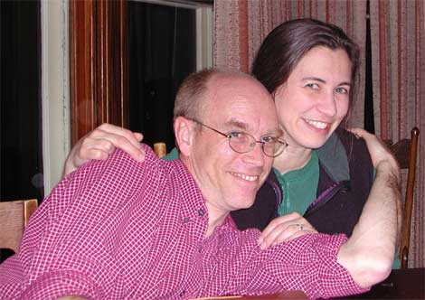
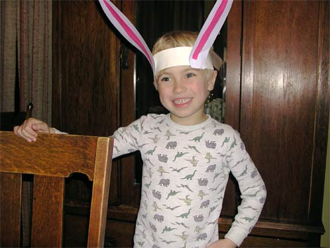
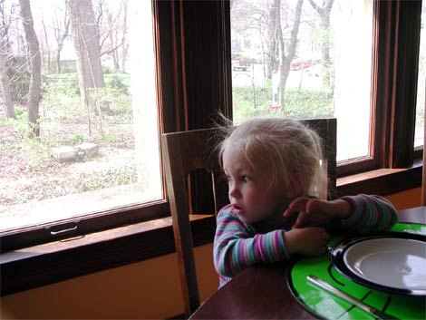

We had the night off last night, so we left Chicago and drove a couple hours to West Lafayette, Indiana where my friend Hilary lives with his wife Ann and their son Haley and daughter Linnea. Haley is 5 and Linnea is 3, and they’re both really beautiful and sweet.

Hilary and Ann.

Haley re-enacting A Christmas Story.

Linnea at breakfast.

Darren and Hilary.

Hilary and Ann live in a beautiful house right near the Purdue campus, and they both work at the University of Purdue. Ann is a research scientist and is also teaching her first class this semester, and Hilary is the lead web designer and developer for the University’s website.

Hilary went all out and put on this amazing dinner spread: vegan lentil curry stew with spiced yogurt, shish kebabs with chicken and red and green peppers, sauteed spinach, and a baby greens salad with walnuts and gorgonzola. It was a terrific feast, right when I was just getting used to eating chinese food out of a box. After eating, we sat around and shared stories from all of our varied pasts. And we laughed. We all have funny pasts.

Before dinner I hung out with Haley who showed me all the different parts of the Dawn Treader, a sailing vessel from the Chronicles of Narnia. Then I played with Linnea who became fascinated with my jacket, so we played zippers and buttons. Then I was tickling her and she pointed her finger right at my face and with the hugest smile she said, “You’re a teasy boy!”

After dinner we had the most amazing strawberry rhubarb pie that Hilary made from scratch and watched a few episodes of South Park. Then we all crashed out for the night.

This morning it sounds like pancakes are in the cards. Mmm mmm yeah.
