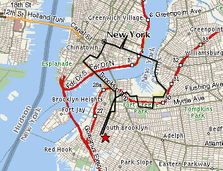

Today I was supposed to run 20 miles. Yeah right.

I went to the gym, and since I was feeling a little wobbly decided to start on the treadmill to warm me up, then hit the street. I ran about 4.5 miles on the treadmill, watching the Kentucky Derby coverage and thinking about random crap. Then I just felt bored with running and my right foot was still hurting (a lot) and I thought there is no way I would be able to make 20 miles, so I quit.

Feeling bummed, I went upstairs to shower, but instead I went into the weight room and did some upper body stuff for a while. Like a half-hour. After that I felt a little better and my legs were feeling fresh so I said ‘Fuck it, I’m gonna run to the Williamsburg Bridge.’

So I left the gym and ran north on Court Street, under the Brooklyn and Manhattan bridges, and meandered through Dumbo and Fort Greene until I eventually made it into Williamsburg, or into a neighborhood near Williamsburg that is heavily populated by Jews. Man, the hats the men wear are amazing. Perfectly round, about 5 or 6 inches thick, solid black, and furry. Straight out of Dr. Seuss. And they all have them. Really amazing. The rest of their clothing is amazingly consistent too, and of course they all have those amazing sideburns. Even the little kids.

I asked a couple of men who were walking along if they could direct me toward the Williamsburg Bridge footpath. They pointed me down Bedford Avenue and I was on my way.

Once over the bridge, I ran north on Clinton Street, across Houston, and along Avenue B to my friends’ Rachel and B’s apartment. There I shared a blackberry and white chocolate gelato thingies from NYC ICY with Rachel and we talked and I rested. Then I ran south again, along Delancey and down Bowery, into Chinatown, and of course stopped off at the Excellent Dumpling House for some more cold sesame noodles. After that I ran south along Centre Street to the Brooklyn Bridge, then over to Brooklyn and south along Court Street back to the gym.

I figure it was somewhere around 13 or 14 miles, including the 4.5 at the gym. It ain’t 20, but it’ll have to do. Meh.

Here’s a rough map of the run:

I know it’s stupid to eat all that crap in the middle of a long run, but I knew I had to keep taking breaks or I would never have made it. I figure when I get to Prague I’ll just stop at all the different cafes along the marathon route. I wonder how long the race officials will wait for me at the finish line?
