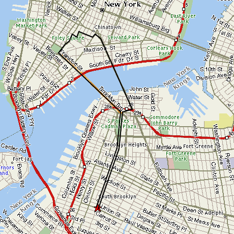

Today I did a loop over the Manhattan and Brooklyn bridges and back to the gym. Then I did another mile on the treadmill, to be sure I was over 5 miles for the day.

For the map-happy:

Before that I went to the Fall Cafe for a little while and ate an almond croissant. While I was there I met this really cool girl named Isabella. She wasn’t shy at all, just came up and introduced herself. She told me about her plans for the day, she said she was going to pick up the laundry and fold it and then she was gonna ride her scooter to the park. She also told me she’s having a birthday party in Central Park in June. Sounds awesome. Then she’ll be 4 years old and next year she goes to school. I remember when school was exciting.

Isabella’s mom was pretty cool too, but I didn’t catch her name.

I just had a big salad with baby greenses and cashews and strawberries and blue cheese. Mmmm mmmm good. Now it’s really sunny and I think I’m gonna go to the park and read. Maybe I’ll run into Isabella again.
