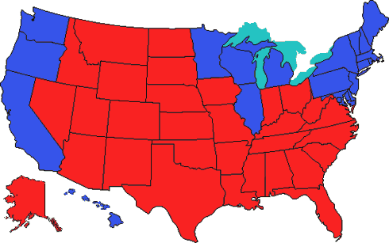

Sean Hannity on the Fox “News” Channel recently held up a map of the United States showing all the red and blue states. He said something to the effect of “Look at all that red!” Clearly an attempt to show that the vast majority of Americans support President Bush.

Bush and Cheney have done some similar day-after analysis of the election results, claiming that the American voters have handed them a clear mandate. This is far from the case. Bush touts the fact that he received the most votes of any presidential candidate in history. This is true, but he doesn’t tell you who received the 2nd most votes in history: John Kerry. In other words, Bush received more votes <b>against</b> him than any winning incumbent candidate in history. The American populace is clearly divided in half over George W. Bush and his policies. There is no simple mainstream. There are two streams, of about equal size, with opposing currents. (Obviously, that’s a vast oversimplification, but American political discourse is rife with oversimplification. Cut me some slack.)

This brings us back to the Red state versus Blue state phenomenon. The GOP media is basically using desert as a political tool. I’m not belittling the states that went for Bush; I’m just saying they are for the most part much larger geographically than many of the states that went for Kerry, and they have much lower population density. But their geographic size makes for an impressive amount of red on the map.

This is a perfect tool for pundits like Sean Hannity. “Look at all that red!” Yes, there’s a lot of red, but it’s very misleading. So I decided to make my own map.

Using final vote percentages from <a href="http://www.electoral-vote.com/">electoral-vote.com</a>, I made a map showing the percentage of “red” voters in each state along with the percentage of “blue” voters. The color on top of each state shows the party that won that state’s electoral votes. (Note: this is not perfectly scientific, as my approximations were made by eye, but I tried to be as accurate as possible for the purpose of this exercise.)

Here we see a slightly better representation of the feelings of the American populace. <b>Those red states have a lot of blue in them.</b> The reverse also holds true for the blue states, with the notable exception of Washington, D.C., where an overwhelming 90% of citizens voted for Kerry. D.C. is only 6 pixels high on this map, but to be fair I gave the bottom row to red.

The District of Columbia makes for an interesting example of another failing of the conventional red state-blue state map, as well as of this map: voters from different states are not equally represented. For example, the little bit of blue in D.C. represents nearly 20,000 more voters than the large swath of red in Wyoming. Similarly, the blue in New York State represents more voters than all the red in Montana, Idaho, North Dakota, South Dakota, Nebraska, Nevada, Utah, Arizona, and New Mexico <b>combined</b>. (These numbers come from <a href="http://news.yahoo.com/electionresults/">Yahoo’s election results page</a>.)

To be very clear, I am <b>not saying</b> that New York’s blue voters are more important (or smarter, or better, or richer, or anything) than all the red voters in Montana, Idaho, North Dakota, South Dakota, Nebraska, Nevada, Utah, Arizona, and New Mexico. I’m simply saying that there are <b>more</b> of them, and that the maps do not accurately reflect this.

So please don’t be fooled by all the red on that map that Hannity and others are waving around. Mr. President, please don’t ignore all the blue staters in those red states. And don’t make us start putting stars on our bellies.
