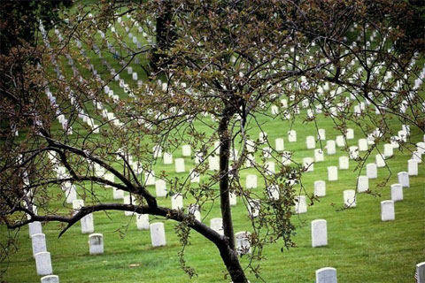

Today we should take a moment to honor our veterans.

Some veterans and their families have also erected a memorial for those soldiers who have died in Iraq at <a href="http://www.veteransforpeace.org/Arlington_west_121003.htm">Arlington West</a>.

3 Comments

<!--

Posted by John F
Thursday, November 11, 2004
 1:00 PM

Thank You Pascal

Posted by an anonymous coward
Friday, November 12, 2004
 2:29 PM

i like that you think of other things than your self and that you can talk abou thtings that others cant and not even cry. you are one of my heros if you can do that if you ask ne

Posted by Pascal
Friday, November 12, 2004
 2:45 PM

Oh but I do cry. I’m no hero in that regard, if that’s how you define a hero.
 -->
