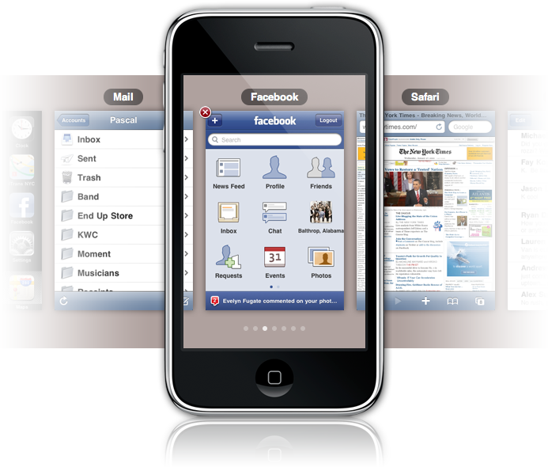

_\[ I'd like to preface this by saying that multitasking is not the same as allowing apps to run in the background. This is really a UI for better app-switching (cf. [this tweet from @camh](https://twitter.com/camh/statuses/8874382135)) — whether the non-frontmost apps are still actually running is a separate discussion. They could just as easily be 'sleeping,' as apps do today when you press the home button. \]_

It seems to me that from a UI perspective, the problem of multitasking in iPhone OS has already been solved. Both Safari and the Springboard (Home) app have the ability to slide from window to window, or screen to screen. A similar solution could be used to switch between running applications. Let's call it 'App Switching Mode.'

The only major UI detail to sort out is how to enter App Switching Mode. Presumably it would be triggered by some touch gesture. For example, perhaps you could hold the home button while swiping left or right on the screen. What the exact gesture might be is anyone's guess; for the purposes of this proposal let's just call it the 'App Switching Gesture.'

Performing the App Switching Gesture would shrink the current app screen down, revealing the screens of other running apps on the left and right. Then you'd use the familiar left and right swipes to move from app to app, and then tap an app to bring it forward. Like I said, very similar to pages in Safari.

### See it in action

Here's a quick demo I put together with the helpful magic of [jQuery](http://www.jquery.com). _\[ Update: I've since refactored this as a Svelte component, just for the funs. It works basically the same as before. You can [see the old jQuery version here](/misc/iphone-switcher/index.html). \]_

<PhoneSwitcher/>

Since it's a pain to imitate multitouch gestures in Javascript, I just created buttons as stand-ins. Click 'Activate switcher' to see the demo, then click 'Swipe Left' or 'Swipe Right' to move from screen to screen. Then tap an app to bring it forward. (I only tested this demo in Safari and Firefox, so I make no guarantees that it will work in other browsers.)

Clicking the 'x' on an app would close that app, just as pressing the home button does currently. Switching to the Home app would allow you to launch any other app, which would then show up as another screen in the app switcher. If you launch an app that's already running, it would just switch to that app rather than spawn a new process, similar to Spaces on Mac OS X. In fact this whole concept is similar to Spaces, except that there is only one app per space, and only one space per app.

One nice thing about this solution is that it wouldn't require users to change their existing behavior whatsoever. They can click the home button and use the Springboard app as a rudimentary app switcher, just as we all currently do.

One thing this demo does not address is how to limit the number of running applications. (If Apple ever implements multitasking on the iPhone, I assume they'll still place a limit on the number of running apps, similar to the limit of 8 pages open in Safari.) Say they set the limit at 8 running applications. What happens when you try to launch a ninth? That's a bit of a stumper. Hopefully they're working on it.

One thing that might help solve that problem is a more robust notifications framework. Hopefully they're working on that too.

Obviously there are some technical hurdles, specifically CPU usage and battery life, that make multitasking on the current iPhone impractical. Presumably those issues will be mitigated with time. But it may also be the case that Apple doesn't feel that the convenience that multitasking provides would outweigh the UI complexities that accompany it. The iPad, which has a killer CPU and great battery life, doesn't have multitasking either — which may be an indicator that Apple doesn't plan to implement multitasking even when CPU usage and battery life aren't an issue. I hope I'm wrong on that count.
