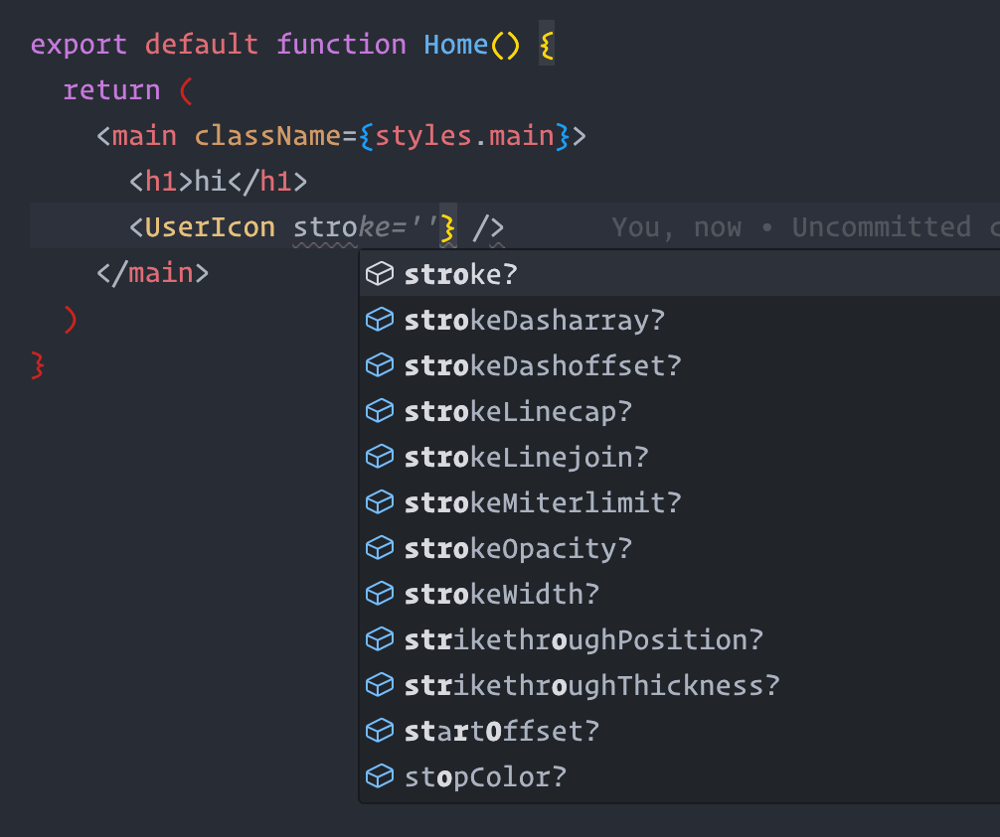

Today I decided to try out [NextJS](https://nextjs.org) for the first time. One of the first things I like to test out when trying a new framework is how it handles SVGs and other assets.

<details>
  <summary>A little rant</summary>

_In so many apps I've worked on, images and other assets are treated as second-class citizens, relegated to some root-level assets directory where they may or may not get used, just sitting there collecting dust. I much prefer to treat assets as first-class dependencies and colocate them next to the components that use them. This allows the file structure of the app to express these relationships more clearly, so it's obvious what images are being used by which parts your application or website. This is especially useful if you're jumping among different projects, where you might not work on a given project for months at a time and then have to come back and refamiliarize yourself._

</details>

A big part of my process for building web applications is to render SVG icons inline, rather than loading them with ``. Having them inline allows them to inherit color from the parent node, and also allows you to style them with CSS, apply CSS variables, all that good stuff.

Out of the box, NextJS allows importing SVGs, but as far as I can tell those imports are primarily meant to be used as `src` props for the NextJS `Image` component. So I did some <span title="Fuck Google">DuckDuckGoing</span> for 'nextjs inline svg' and found this handy package: [svgr](https://react-svgr.com).

They have [instructions for modifying your NextJS config](https://react-svgr.com/docs/next/) but those didn't work for me; the NextJS app kept complaining that there was no loader configured. But cribbing from there I was able to figure out this solution, and I thought it might help someone else who's stumbling down this same path.

## Modify the NextJS webpack config

```javascript
// next.config.js
/** @type {import('next').NextConfig} */
const nextConfig = {
  webpack(config) {
    // grab the default rule for handling all images
    const imageLoaderRule = config.module.rules.find((rule) => rule.test?.test?.('.svg'));

    config.module.rules = [
      // keep all rules except the default image loader rule
      ...config.module.rules.filter((rule) => rule !== imageLoaderRule),

      // re-add the default image loader rule, but exclude svg
      {
        ...imageLoaderRule,
        exclude: /\.svg$/i,
      },

      // add a new rule for svg files, excluding svg files that are imported as React components
      {
        ...imageLoaderRule,
        test: /\.svg$/i,
        resourceQuery: {
          ...imageLoaderRule.resourceQuery,
          not: [
            ...imageLoaderRule.resourceQuery.not,
            /component/, // *.svg?component
          ],
        },
      },

      // add a new rule for svg files that are imported as React components
      {
        test: /\.svg$/i,
        issuer: /\.[jt]sx?$/,
        use: '@svgr/webpack',
        resourceQuery: /component/, // *.svg?component
      },
    ];

    return config;
  },
};

module.exports = nextConfig;
```

With this config, importing an SVG as a component is opt-in, using `?component` as a query string on the path, so you can still use regular SVG imports with the NextJS Image component if you want.

## Usage

```jsx
import PngImage from './some.png';
import JpegImage from './some.jpg';
import GifImage from './some.gif';
import SvgImage from './some.svg';
import SvgComponent from './some.svg?component';

export default function App() {
  return (
    <main>
      <Image src={PngImage} alt="PNG Image" />
      <Image src={JpegImage} alt="JPEG Image" />
      <Image src={GifImage} alt="GIF Image" />
      <Image src={SvgImage} alt="SVG Image" />
      <SvgComponent />
    </main>
  );
}
```

## TypeScript bonus

Finally, if you're using TypeScript, you'll want to declare a module for this import type. I put this in src/types.ts:

```typescript
declare module '*.svg?component' {
  import { FC, SVGProps } from 'react';
  const content: FC<SVGProps<SVGElement>>;
  export default content;
}
```

Doing that gets you nice autocomplete for passing SVG props to your SVG components:

{ .polaroid loading=lazy }

"You, now · Uncommitted." Haha.
