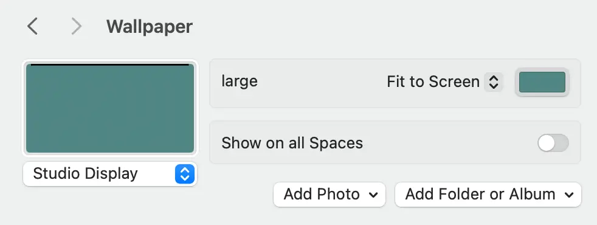
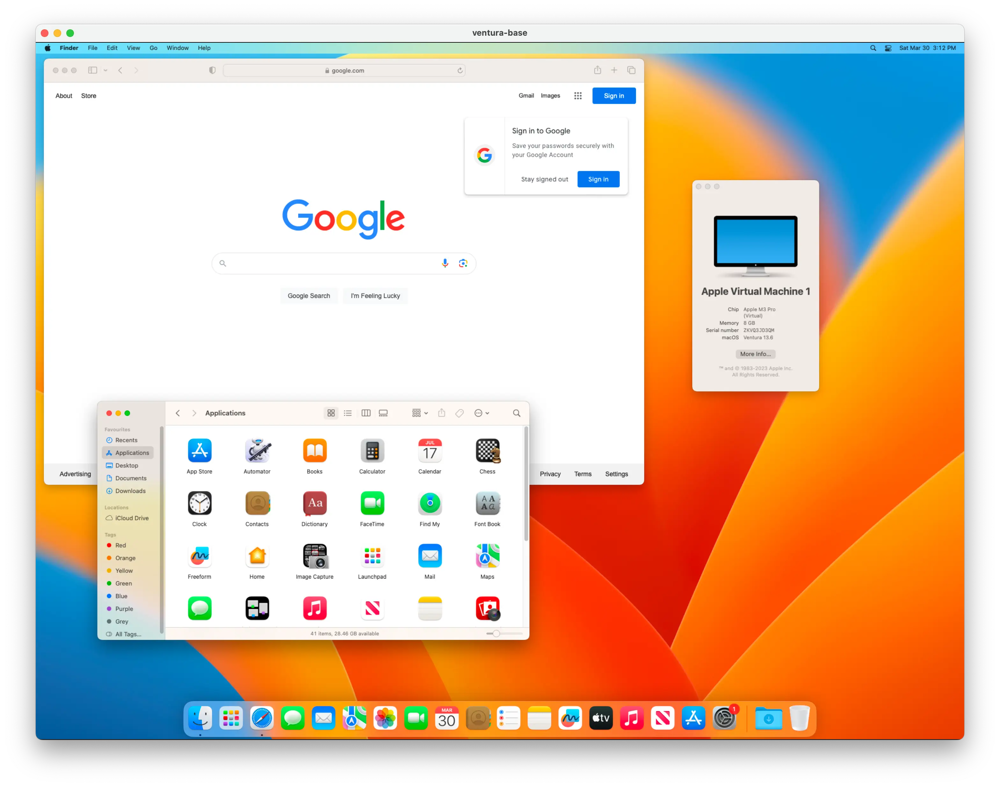

In the macOS AppKit framework, there's an API for setting the current desktop image, scaling method, and fill color. The method is [`NSWorkspace.shared.setDesktopImageURL`](https://developer.apple.com/documentation/appkit/nsworkspace/1527228-setdesktopimageurl). This method accepts a file URL, a screen reference, and an options dicitionary, including `fillColor`.

{ .polaroid loading=lazy style="--deg: 0" width=600 }

Here's some sample code:

<details open>
  <summary><code>SetDesktopImageURL.swift</code></summary>

```swift
import Foundation
import AppKit

let workspace = NSWorkspace.shared
let screens = NSScreen.screens

let image = NSURL.fileURL(withPath: "/path/to/some/wallpaper.png")

// A nice blue green. This will show through any transparent areas of this image
let color = NSColor(calibratedRed: 64/255, green: 116/255, blue: 112/255, alpha: 1.0)

// NSImageScaling options https://developer.apple.com/documentation/appkit/nsimagescaling
let fit = NSImageScaling.scaleProportionallyUpOrDown.rawValue

let options: [NSWorkspace.DesktopImageOptionKey: Any] = [
  .allowClipping: false,
  .imageScaling: fit,
  .fillColor: color,
]

for screen in screens {
  try workspace.setDesktopImageURL(image, for: screen, options: options)
}
```

</details>

We can verify the result using a related API method, [`NSWorkspace.shared.desktopImageOptions`](https://developer.apple.com/documentation/appkit/nsworkspace/1530855-desktopimageoptions). This method returns a dictionary of the current desktop image options for the given screen.

More sample code:

<details open>
  <summary><code>DesktopImageOptions.swift</code></summary>

```swift
import AppKit
import Foundation

let screen = NSScreen.main!
let options = NSWorkspace.shared.desktopImageOptions(for: screen)!

print("imageScaling:", options[.imageScaling] as Any)
print("allowClipping:", options[.allowClipping] as Any)
print("fillColor:", options[.fillColor] as Any)
```

</details>

This code works as expected in macOS Monterey (version 12.x) and macOS Ventura (version 13.x):

#### Monterey

```
macOS version: 12.4.0
imageScaling: Optional(3)
allowClipping: Optional(0)
fillColor: Optional(NSCalibratedRGBColorSpace ...) <-- good
```

#### Ventura

```
macOS version: 13.6.0
imageScaling: Optional(3)
allowClipping: Optional(0)
fillColor: Optional(NSCalibratedRGBColorSpace ...) <-- good
```

But in Sonoma (version 14.x), the `fillColor` key is missing from the returned dictionary:

#### Sonoma

```
macOS version: 14.4.1
imageScaling: Optional(3)
allowClipping: Optional(0)
fillColor: nil <-- bad
```

Similarly, when calling `setDesktopImageURL`, Sonoma seems to ignore the `fillColor` option, and always sets the fill color to some default blue (even if I have previously set it to some other color manually.)

### Next steps

So at this point I'm pretty sure this is a regression in macOS Sonoma. If you have any experience with this API and know of a workaround, [I'd love to hear it!](mailto:pascal+fillcolor@pascal.com) If you'd like to try out the above on your Mac and report your results to me, I've created a [minimal sample project](https://github.com/pascalpp/current-desktop-color) on Github. I'm working up the nerve to file a bug report with Apple, but I haven't done that before and from what I've heard I'm not particularly hopeful that it will get me anywhere. But I'll try anyway.

### A cool thing I found along the way…

I discovered this amazing macOS virtualization tool, [Tart](https://tart.run/quick-start/).



It allows you to run different versions of macOS (and Linux) in virtual containers on your Mac. I used it to test the above code on Ventura, as I didn't have a machine with that version running. [The setup is dead-easy](https://tart.run/quick-start/) (if you already have `homebrew` installed). It does take a while to download an OS image, but once that's done the container starts up incredibly quickly, and feels just as responsive as my actual Mac. Definitely worth a look if you do any macOS development.
